# Document Relationship Map

This document visualizes the relationships between all documentation in ProjectTemplate, helping you navigate and
understand the connections between different resources.

## Table of Contents

1. [🗺️ High-Level Navigation Map](#-high-level-navigation-map)
2. [📚 Document Categories and Relationships](#-document-categories-and-relationships)
  3. [1. Entry Points](#1-entry-points)
  4. [2. Core Concepts](#2-core-concepts)
  5. [3. AI Development Chain](#3-ai-development-chain)
  6. [4. Decision Making Flow](#4-decision-making-flow)
  7. [5. Development Workflow Documents](#5-development-workflow-documents)
  8. [6. Cross-Reference Matrix](#6-cross-reference-matrix)
  9. [7. Navigation Patterns](#7-navigation-patterns)
10. [🔄 Bidirectional References](#-bidirectional-references)
11. [📍 Quick Links by Use Case](#-quick-links-by-use-case)
  12. ["I want to customize the template"](#i-want-to-customize-the-template)
  13. ["I need to debug an issue"](#i-need-to-debug-an-issue)
  14. ["I want to use local AI models"](#i-want-to-use-local-ai-models)
  15. ["I need to generate code"](#i-need-to-generate-code)

## 🗺️ High-Level Navigation Map

```mermaid
graph TB
    README[README.md<br/>Entry Point]
    CLAUDE[CLAUDE.md<br/>AI Instructions]
    FRICTION[FRICTION-MAPPING.md<br/>Problem→Solution Map]

    README --> CLAUDE
    README --> FRICTION
    README --> DOCS[docs/<br/>All Documentation]
    README --> AI[ai/config/<br/>AI Configurations]

    CLAUDE --> FRICTION
    CLAUDE --> AI
    CLAUDE --> SCRIPTS[scripts/<br/>Automation Tools]

    FRICTION --> AI
    FRICTION --> SCRIPTS
    FRICTION --> EXAMPLES[ai/examples/<br/>Patterns]

    DOCS --> GUIDES[guides/<br/>How-To Guides]
    DOCS --> ARCH[architecture/<br/>Technical Decisions]
    DOCS --> DECISIONS[newproject_decisions/<br/>Stack Selection]

    AI --> MODELS[Local Model Setup]
    AI --> CONTEXT[Context Management]

    SCRIPTS --> GENERATORS[Code Generators]
    SCRIPTS --> DEBUG[Debug Tools]
```



## 📚 Document Categories and Relationships

### 1. Entry Points

These documents are where users typically start:

| Document    | Purpose                          | Links To                                       |
| ----------- | -------------------------------- | ---------------------------------------------- |
| `README.md` | Project overview and quick start | CLAUDE.md, FRICTION-MAPPING.md, all guides     |
| `CLAUDE.md` | Comprehensive AI assistant rules | All development workflows, tools, and patterns |
| `SETUP.md`  | Initial project customization    | CLAUDE.md, decision matrices                   |

### 2. Core Concepts

Central documents that explain the template's philosophy:

| Document                        | Purpose                       | Cross-References
|
| ------------------------------- | ----------------------------- |
--------------------------------------------------------- |
| `FRICTION-MAPPING.md`           | Maps problems to solutions    | Links to specific implementations in ai/, scripts/,
docs/ |
| `template-architecture.md`      | Explains structure and design | References all major directories
|
| `docs/DOCUMENTATION_ROADMAP.md` | Index of all documentation    | Links to every doc file
|

### 3. AI Development Chain

Documents that support AI-assisted development:

```text
ai/config/README.md
    ├─→ .claude (Claude configuration)
    ├─→ .cursorrules (Cursor IDE rules)
    ├─→ .copilot (GitHub Copilot config)
    ├─→ models.json (Local model settings)
    └─→ context-rules.json (Context optimization)
         ↓
docs/guides/ai-development/
    ├─→ local-model-setup.md ←→ ai/config/models.json
    ├─→ working-with-cursor.md ←→ ai/config/.cursorrules
    ├─→ prompt-engineering.md ←→ ai/prompts/
    └─→ ai-debugging.md ←→ scripts/dev/debug-snapshot.sh
         ↓
scripts/dev/
    ├─→ context-optimizer.sh ←→ ai/config/context-rules.json
    ├─→ ai-context-dump.sh ←→ FRICTION-MAPPING.md §1.1
    └─→ debug-snapshot.sh ←→ CLAUDE.md §Debug-Context
```

### 4. Decision Making Flow

How technical decisions connect:

```text
docs/newproject_decisions/
    ├─→ TECHNICAL_STACK_GAPS_ANALYSIS.md (Overview)
    │    ├─→ decision-matrix-backend-runtime.md
    │    ├─→ decision-matrix-api-architecture.md
    │    ├─→ decision-matrix-database.md
    │    ├─→ decision-matrix-frontend.md
    │    └─→ decision-matrix-build-tools.md
    │         ↓
    └─→ local-development-stack-guide.md (Recommendations)
         ├─→ local-error-handling.md
         ├─→ ai-integration-patterns.md
         └─→ desktop-app-patterns.md
```

### 5. Development Workflow Documents

**Testing Chain:**

```text
CLAUDE.md §Test-First-Development
    ↓
docs/guides/testing/comprehensive-testing-guide.md
    ↓
templates/component/{{name}}.test.tsx.hbs
    ↓
ai/prompts/testing/unit-tests.md
```

**Debugging Chain:**

```text
CLAUDE.md §Arrow-Chain-RCA
    ↓
CLAUDE.md §Debug-Context-Capture
    ↓
scripts/dev/debug-snapshot.sh
    ↓
ai/prompts/debugging/error-analysis.md
```

**Code Generation Chain:**

```text
CLAUDE.md §Generator-Tools
    ↓
tools/generators/component-generator.js
    ↓
templates/component/
    ↓
ai/examples/good-patterns/
```

### 6. Cross-Reference Matrix

This matrix shows which documents reference each other:

| From ↓ / To →                      | README | CLAUDE | FRICTION | Local Models | Testing | Generators |
| ---------------------------------- | ------ | ------ | -------- | ------------ | ------- | ---------- |
| **README.md**                      | -      | ✓      | ✓        | ✓            | ✓       | ✓          |
| **CLAUDE.md**                      | ✓      | -      | ✓        | ✓            | ✓       | ✓          |
| **FRICTION-MAPPING.md**            | ✓      | ✓      | -        | ✓            | ✓       | ✓          |
| **local-model-setup.md**           | ✓      | ✓      | ✓        | -            | ✓       | ✓          |
| **comprehensive-testing-guide.md** | ✓      | ✓      | ✓        | -            | -       | ✓          |
| **component-generator.js**         | ✓      | ✓      | ✓        | -            | ✓       | -          |

### 7. Navigation Patterns

**For New Users:**

1. Start with `README.md`
2. Read `CLAUDE.md` for AI rules
3. Review `FRICTION-MAPPING.md` to understand solutions
4. Explore specific guides as needed

**For Setting Up AI Tools:**

1. `ai/config/README.md` - Overview
2. `docs/guides/ai-development/local-model-setup.md` - Local models
3. `scripts/dev/context-optimizer.sh` - Context management
4. `ai/config/` files - Specific tool configs

**For Making Technical Decisions:**

1. `docs/newproject_decisions/TECHNICAL_STACK_GAPS_ANALYSIS.md` - Overview
2. Relevant decision matrices
3. `local-development-stack-guide.md` - Recommendations

**For Daily Development:**

1. `CLAUDE.md` - Always open for reference
2. Generator tools for new components
3. Debug scripts for troubleshooting
4. Testing guides for quality

## 🔄 Bidirectional References

These documents have strong two-way relationships:

- **CLAUDE.md ↔ FRICTION-MAPPING.md**: Rules solve frictions, frictions inform rules
- **local-model-setup.md ↔ ai/config/models.json**: Setup guide explains config
- **context-optimizer.sh ↔ context-rules.json**: Script uses rules, rules documented in script
- **comprehensive-testing-guide.md ↔ test templates**: Guide explains templates usage

## 📍 Quick Links by Use Case

### "I want to customize the template"

- Start: `SETUP.md`
- Then: `CLAUDE.md` (update project-specific sections)
- Finally: Decision matrices in `docs/newproject_decisions/`

### "I need to debug an issue"

- Start: `CLAUDE.md` §Arrow-Chain-RCA
- Use: `scripts/dev/debug-snapshot.sh`
- Reference: `ai/prompts/debugging/`

### "I want to use local AI models"

- Start: `docs/guides/ai-development/local-model-setup.md`
- Configure: `ai/config/models.json`
- Optimize: `scripts/dev/context-optimizer.sh`

### "I need to generate code"

- Use: `npm run g:component`
- Customize: `templates/component/`
- Reference: `CLAUDE.md` §Generator-Tools

This relationship map helps you understand how all pieces of ProjectTemplate work together to create a cohesive
AI-assisted development experience.
