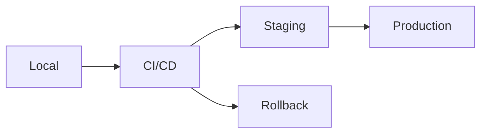

# Deployment Process Guide

## Table of Contents

1. [Overview](#overview)
2. [Deployment Pipeline](#deployment-pipeline)
3. [Pre-Deployment Checklist](#pre-deployment-checklist)
  4. [Code Quality Gates](#code-quality-gates)
  5. [Security Verification](#security-verification)
  6. [Documentation Updates](#documentation-updates)
7. [Deployment Environments](#deployment-environments)
  8. [Local Development](#local-development)
  9. [CI/CD Pipeline](#cicd-pipeline)
    10. [GitHub Actions Workflow](#github-actions-workflow)
  11. [Staging Deployment](#staging-deployment)
    12. [1. Deploy to Staging](#1-deploy-to-staging)
    13. [2. Staging Validation](#2-staging-validation)
    14. [3. Performance Validation](#3-performance-validation)
  15. [Production Deployment](#production-deployment)
    16. [1. Pre-Production Steps](#1-pre-production-steps)
    17. [2. Deploy to Production](#2-deploy-to-production)
    18. [3. Post-Deployment Verification](#3-post-deployment-verification)
19. [Deployment Strategies](#deployment-strategies)
  20. [Blue-Green Deployment](#blue-green-deployment)
  21. [Canary Deployment](#canary-deployment)
  22. [Rolling Deployment](#rolling-deployment)
23. [Database Migrations](#database-migrations)
  24. [Safe Migration Process](#safe-migration-process)
  25. [Migration Optimal Practices](#migration-optimal-practices)
26. [Rollback Procedures](#rollback-procedures)
  27. [Immediate Rollback](#immediate-rollback)
  28. [Database Rollback](#database-rollback)
  29. [Feature Flag Rollback](#feature-flag-rollback)
30. [Monitoring Post-Deployment](#monitoring-post-deployment)
  31. [Key Metrics](#key-metrics)
  32. [Alert Configuration](#alert-configuration)
  33. [Deployment Verification Script](#deployment-verification-script)
34. [Environment Configuration](#environment-configuration)
  35. [Environment Variables](#environment-variables)
  36. [Configuration Validation](#configuration-validation)
37. [Deployment Automation](#deployment-automation)
  38. [Deployment Script](#deployment-script)
39. [Troubleshooting Deployments](#troubleshooting-deployments)
  40. [Common Issues](#common-issues)
    41. [Build Failures](#build-failures)
    42. [Migration Failures](#migration-failures)
    43. [Performance Degradation](#performance-degradation)
  44. [Emergency Procedures](#emergency-procedures)
    45. [Maintenance Mode](#maintenance-mode)
    46. [Incident Response](#incident-response)
47. [Deployment Calendar](#deployment-calendar)
  48. [Deployment Windows](#deployment-windows)
  49. [Deployment Freeze](#deployment-freeze)

## Overview

This guide covers the deployment process from local development to production, including safety checks, rollback
procedures, and monitoring.

## Deployment Pipeline



## Pre-Deployment Checklist

### Code Quality Gates

```bash
# Run all quality checks
npm run ai:check

# Individual checks if needed
npm run lint
npm run type-check
npm run test
npm run build
```

### Security Verification

```bash
# Security audit
npm audit --production
./scripts/dev/check-security.sh

# Check for secrets
git secrets --scan
grep -r "PRIVATE\|SECRET\|PASSWORD" --exclude-dir=node_modules .
```

### Documentation Updates

- [ ] CHANGELOG.md updated
- [ ] API documentation current
- [ ] Migration guide (if breaking changes)
- [ ] Runbook updated

## Deployment Environments

### Local Development

```bash
# Start local environment
npm run dev

# With production-like settings
NODE_ENV=production npm run build
npm run start
```

### CI/CD Pipeline

#### GitHub Actions Workflow

```yaml
name: Deploy
on:
  push:
    branches: [main]
  workflow_dispatch:

jobs:
  test:
    runs-on: ubuntu-latest
    steps:
      - uses: actions/checkout@v4
      - run: npm ci
      - run: npm run test:ci

  deploy-staging:
    needs: test
    runs-on: ubuntu-latest
    steps:
      - uses: actions/checkout@v4
      - run: npm run deploy:staging

  deploy-production:
    needs: deploy-staging
    runs-on: ubuntu-latest
    environment: production
    steps:
      - uses: actions/checkout@v4
      - run: npm run deploy:production
```

### Staging Deployment

#### 1. Deploy to Staging

```bash
# Automatic deployment on main branch
git push origin main

# Manual deployment
npm run deploy:staging

# Or using CLI
npx vercel --env=staging
```

#### 2. Staging Validation

```bash
# Run smoke tests
npm run test:smoke:staging

# Check health endpoint
curl https://staging.app.com/api/health

# Run E2E tests
npm run test:e2e:staging
```

#### 3. Performance Validation

```bash
# Run Lighthouse
npm run lighthouse:staging

# Load testing
npm run load-test:staging
```

### Production Deployment

#### 1. Pre-Production Steps

```bash
# Create release tag
git tag -a v1.2.3 -m "Release: Feature XYZ"
git push origin v1.2.3

# Generate release notes
gh release create v1.2.3 --generate-notes
```

#### 2. Deploy to Production

```bash
# With approval required
npm run deploy:production

# Emergency deployment
SKIP_CHECKS=true npm run deploy:production:emergency
```

#### 3. Post-Deployment Verification

```bash
# Health checks
./scripts/verify-deployment.sh production

# Monitor error rates
npm run monitor:errors:production

# Check key user flows
npm run test:critical:production
```

## Deployment Strategies

### Blue-Green Deployment

```bash
# Deploy to green environment
npm run deploy:green

# Switch traffic
npm run switch:blue-to-green

# Keep blue as instant rollback
```

### Canary Deployment

```javascript
// Feature flag configuration
{
  "new-feature": {
    "enabled": true,
    "rollout": {
      "percentage": 10,  // Start with 10%
      "increment": 10,   // Increase by 10%
      "interval": "1h"   // Every hour
    }
  }
}
```

### Rolling Deployment

```bash
# Deploy to subset of instances
for instance in $(kubectl get pods -l app=myapp -o name); do
  kubectl set image $instance app=myapp:v1.2.3
  kubectl wait --for=condition=ready $instance
  sleep 60  # Monitor before next
done
```

## Database Migrations

### Safe Migration Process

```bash
# 1. Backup database
npm run db:backup:production

# 2. Run migrations in transaction
npm run db:migrate:production

# 3. Verify migrations
npm run db:verify:production
```

### Migration Optimal Practices

- Always backwards compatible
- Test rollback procedure
- Run during low-traffic periods
- Monitor query performance

## Rollback Procedures

### Immediate Rollback

```bash
# Revert to previous version
npm run deploy:rollback

# Or manually
git revert HEAD
git push origin main
```

### Database Rollback

```bash
# Rollback last migration
npm run db:rollback:production

# Restore from backup
npm run db:restore:production --backup=2024-01-01-1200
```

### Feature Flag Rollback

```javascript
// Disable feature immediately
await featureFlags.disable("problematic-feature");

// Or reduce rollout
await featureFlags.setRollout("problematic-feature", 0);
```

## Monitoring Post-Deployment

### Key Metrics

```bash
# Application metrics
- Response time: < 200ms p95
- Error rate: < 0.1%
- CPU usage: < 70%
- Memory usage: < 80%

# Business metrics
- Conversion rate
- User engagement
- Feature adoption
```

### Alert Configuration

```yaml
alerts:
  - name: high-error-rate
    condition: error_rate > 1%
    duration: 5m
    notify: [pagerduty, slack]

  - name: slow-response
    condition: response_time_p95 > 500ms
    duration: 10m
    notify: [slack]
```

### Deployment Verification Script

```bash
#!/bin/bash
# verify-deployment.sh

echo "Verifying deployment..."

# Check health
health=$(curl -s https://api.app.com/health)
if [[ $health != *"ok"* ]]; then
  echo "Health check failed!"
  exit 1
fi

# Check version
version=$(curl -s https://api.app.com/version)
echo "Deployed version: $version"

# Run smoke tests
npm run test:smoke:production

# Check error rates
errors=$(curl -s https://monitoring.app.com/api/errors?last=5m)
if [[ $errors -gt 10 ]]; then
  echo "High error rate detected!"
  exit 1
fi

echo "Deployment verified successfully!"
```

## Environment Configuration

### Environment Variables

```bash
# Production secrets (stored securely)
DATABASE_URL=
REDIS_URL=
API_KEY=
JWT_SECRET=

# Feature flags
ENABLE_NEW_FEATURE=false
MAINTENANCE_MODE=false

# Performance
NODE_OPTIONS="--max-old-space-size=4096"
CLUSTER_WORKERS=4
```

### Configuration Validation

```typescript
// Validate all required env vars on startup
import { z } from "zod";

const envSchema = z.object({
  DATABASE_URL: z.string().url(),
  REDIS_URL: z.string().url(),
  API_KEY: z.string().min(32),
  NODE_ENV: z.enum(["development", "staging", "production"]),
});

export const env = envSchema.parse(process.env);
```

## Deployment Automation

### Deployment Script

```bash
#!/bin/bash
# deploy.sh

set -e

ENVIRONMENT=$1
VERSION=$2

echo "Deploying $VERSION to $ENVIRONMENT"

# Pre-deployment checks
./scripts/pre-deploy-checks.sh

# Build
npm run build

# Run migrations
npm run db:migrate:$ENVIRONMENT

# Deploy
case $ENVIRONMENT in
  staging)
    npm run deploy:staging
    ;;
  production)
    npm run deploy:production
    ;;
  *)
    echo "Unknown environment: $ENVIRONMENT"
    exit 1
    ;;
esac

# Post-deployment verification
./scripts/verify-deployment.sh $ENVIRONMENT

# Notify team
./scripts/notify-deployment.sh $ENVIRONMENT $VERSION

echo "Deployment complete!"
```

## Troubleshooting Deployments

### Common Issues

#### Build Failures

```bash
# Clear cache and rebuild
rm -rf .next node_modules
npm ci
npm run build
```

#### Migration Failures

```bash
# Check migration status
npm run db:status

# Manually run failed migration
npm run db:migrate:specific 20240101-add-user-table
```

#### Performance Degradation

```bash
# Profile production build
npm run build:profile

# Analyze bundle
npm run build:analyze
```

### Emergency Procedures

#### Maintenance Mode

```bash
# Enable maintenance mode
npm run maintenance:enable

# Deploy fix
npm run deploy:production:emergency

# Disable maintenance mode
npm run maintenance:disable
```

#### Incident Response

1. Acknowledge incident
2. Assess impact
3. Implement fix or rollback
4. Verify resolution
5. Post-mortem

## Deployment Calendar

### Deployment Windows

- **Regular**: Tuesday/Thursday 10am-12pm
- **Emergency**: Any time with approval
- **Blackout**: Black Friday, Cyber Monday

### Deployment Freeze

- December 15 - January 2
- Major marketing campaigns
- Discovered critical issues

Remember: Every deployment should be reversible. If you can't rollback safely, you're not ready to deploy.
