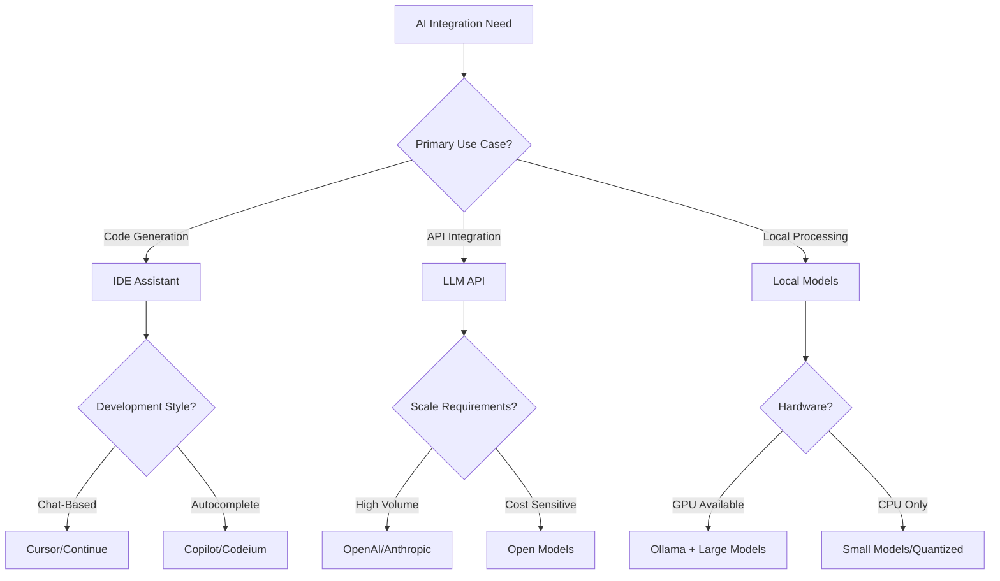

# AI Integration Patterns Decision Guide

## Table of Contents

1. [Quick Decision Flow](#quick-decision-flow)
2. [Requirements Gathering](#requirements-gathering)
  3. [Project Requirements](#project-requirements)
  4. [Technical Requirements](#technical-requirements)
5. [Options Evaluation Matrix](#options-evaluation-matrix)
  6. [IDE AI Assistants](#ide-ai-assistants)
  7. [LLM API Providers](#llm-api-providers)
8. [Detailed Comparison](#detailed-comparison)
  9. [Option A: Cursor IDE](#option-a-cursor-ide)
  10. [Option B: Continue (Open Source)](#option-b-continue-open-source)
  11. [Option C: Local Models with Ollama](#option-c-local-models-with-ollama)
12. [Context Management Patterns](#context-management-patterns)
  13. [Pattern 1: Persistent Context Files](#pattern-1-persistent-context-files)
14. [Project Overview](#project-overview)
15. [Current Focus](#current-focus)
16. [Architecture Rules](#architecture-rules)
  17. [Pattern 2: Selective Context Loading](#pattern-2-selective-context-loading)
  18. [Pattern 3: Prompt Versioning](#pattern-3-prompt-versioning)
19. [AI Code Review Integration](#ai-code-review-integration)
  20. [Automated Review Setup](#automated-review-setup)
  21. [Review Prompt Template](#review-prompt-template)
22. [Context](#context)
23. [Specific Checks](#specific-checks)
24. [Output Format](#output-format)
25. [Prompt Library Organization](#prompt-library-organization)
  26. [Directory Structure](#directory-structure)
  27. [Prompt Composition Tool](#prompt-composition-tool)
28. [Model-Specific Optimizations](#model-specific-optimizations)
  29. [Context Window Management](#context-window-management)
  30. [Temperature Settings by Task](#temperature-settings-by-task)
31. [Cost Optimization Strategies](#cost-optimization-strategies)
  32. [Token Usage Tracking](#token-usage-tracking)
  33. [Smart Model Selection](#smart-model-selection)
34. [Decision Template](#decision-template)
35. [Real-World Examples](#real-world-examples)
  36. [Example 1: Startup Building SaaS](#example-1-startup-building-saas)
  37. [Example 2: Enterprise Internal Tool](#example-2-enterprise-internal-tool)
  38. [Example 3: Open Source Project](#example-3-open-source-project)
39. [AI Assistant Integration](#ai-assistant-integration)
  40. [For Cursor Users](#for-cursor-users)
  41. [For Continue Users](#for-continue-users)
  42. [For Generic AI Assistants](#for-generic-ai-assistants)

## Quick Decision Flow



## Requirements Gathering

### Project Requirements

- [ ] Code generation needs (autocomplete vs chat)
- [ ] Context window requirements (4K, 32K, 128K+)
- [ ] Response latency tolerance
- [ ] Budget constraints per month
- [ ] Privacy/security requirements
- [ ] Team size and collaboration needs
- [ ] Offline capability requirements

### Technical Requirements

- [ ] Language/framework specific support
- [ ] Integration with existing tools
- [ ] Custom prompt engineering needs
- [ ] Model fine-tuning requirements
- [ ] API rate limits acceptable
- [ ] Context persistence needs

## Options Evaluation Matrix

### IDE AI Assistants

| Criteria                 | Cursor     | GitHub Copilot | Codeium    | Continue   |
| ------------------------ | ---------- | -------------- | ---------- | ---------- |
| Context Management (30%) | 10/10      | 7/10           | 8/10       | 9/10       |
| Model Selection (20%)    | 9/10       | 6/10           | 7/10       | 10/10      |
| Local Development (20%)  | 8/10       | 5/10           | 7/10       | 10/10      |
| Cost Efficiency (15%)    | 6/10       | 7/10           | 10/10      | 9/10       |
| Privacy Options (15%)    | 7/10       | 5/10           | 8/10       | 10/10      |
| **Total Score**          | **8.5/10** | **6.3/10**     | **8.2/10** | **9.6/10** |

### LLM API Providers

| Criteria               | OpenAI     | Anthropic  | Google     | Local (Ollama) |
| ---------------------- | ---------- | ---------- | ---------- | -------------- |
| Model Quality (25%)    | 9/10       | 10/10      | 8/10       | 7/10           |
| API Reliability (20%)  | 9/10       | 9/10       | 8/10       | 10/10          |
| Cost per Token (20%)   | 7/10       | 7/10       | 8/10       | 10/10          |
| Privacy/Security (20%) | 6/10       | 7/10       | 6/10       | 10/10          |
| Feature Set (15%)      | 10/10      | 8/10       | 9/10       | 6/10           |
| **Total Score**        | **8.2/10** | **8.4/10** | **7.8/10** | **8.6/10**     |

## Detailed Comparison

### Option A: Cursor IDE

**When to use:**

- Primary development in VS Code ecosystem
- Need sophisticated context management
- Team prefers chat-based interaction
- Budget allows $20/month per developer

**When NOT to use:**

- Require complete offline capability
- Using non-VS Code IDEs (JetBrains, Vim)
- Strict data privacy requirements
- Very limited budget

**Example Implementation:**

```json
// .cursorrules
{
  "context_rules": {
    "always_include": ["@docs/architecture/patterns/", "@ai/examples/"],
    "exclude": ["node_modules/", "*.log", "dist/"],
    "max_tokens": 32000
  },
  "model_preferences": {
    "chat": "claude-3-opus",
    "autocomplete": "gpt-4-turbo",
    "fallback": "claude-3-haiku"
  }
}
```

**Migration Path:**

- Export conversation history regularly
- Maintain prompts in version control
- Use Continue as backup/migration target

### Option B: Continue (Open Source)

**When to use:**

- Need maximum flexibility and control
- Want to use multiple models/providers
- Require local model support
- Open source contribution important

**When NOT to use:**

- Need most polished UX immediately
- Require enterprise support
- Limited technical expertise on team

**Example Implementation:**

```json
// .continue/config.json
{
  "models": [
    {
      "title": "Claude 3 Opus",
      "provider": "anthropic",
      "model": "claude-3-opus-20240229",
      "apiKey": "${ANTHROPIC_API_KEY}"
    },
    {
      "title": "Local Mistral",
      "provider": "ollama",
      "model": "mistral:7b-instruct"
    }
  ],
  "contextProviders": [
    {
      "name": "codebase",
      "params": {
        "nRetrieve": 25,
        "nFinal": 10
      }
    }
  ]
}
```

### Option C: Local Models with Ollama

**When to use:**

- Strict privacy requirements
- No internet connectivity
- Unlimited usage needs
- Have GPU resources available

**When NOT to use:**

- Need cutting-edge model performance
- Limited local compute resources
- Require consistent performance across team

**Example Implementation:**

```bash
# Install and setup
curl -fsSL https://ollama.ai/install.sh | sh
ollama pull mistral:7b-instruct-q4_K_M
ollama pull codellama:13b

# Integration with Continue
{
  "provider": "ollama",
  "model": "codellama:13b",
  "apiBase": "http://localhost:11434"
}
```

## Context Management Patterns

### Pattern 1: Persistent Context Files

```markdown
# ai/.context.md

## Project Overview

[Project description that's always included]

## Current Focus

[Updated per feature/sprint]

## Architecture Rules

- Always use TypeScript strict mode
- Follow patterns in @docs/architecture/patterns/
- Use Zod for validation, never raw type assertions
```

### Pattern 2: Selective Context Loading

```javascript
// scripts/ai-context.js
const contextLoader = {
  minimal: ["README.md", "package.json"],
  feature: ["src/features/${feature}/**/*"],
  architectural: ["docs/architecture/**/*", "ai/examples/**/*"],
  debugging: ["error.log", "tsconfig.json", ".env.example"],
};

function loadContext(type, feature = null) {
  // Generate focused context for AI
}
```

### Pattern 3: Prompt Versioning

```yaml
# ai/prompts/manifest.yml
prompts:
  feature_planning:
    version: 2.1
    models: ["claude-3-opus", "gpt-4"]
    max_tokens: 4000
    temperature: 0.7
    includes:
      - templates/feature-planning-v2.md

  code_review:
    version: 1.3
    models: ["claude-3-haiku", "gpt-3.5-turbo"]
    max_tokens: 2000
    temperature: 0.3
```

## AI Code Review Integration

### Automated Review Setup

```yaml
# .github/workflows/ai-code-review.yml
name: AI Code Review
on: [pull_request]

jobs:
  ai-review:
    runs-on: ubuntu-latest
    steps:
      - uses: actions/checkout@v3
      - name: AI Review
        run: |
          npm run ai:review -- \
            --files=$(git diff --name-only origin/main) \
            --prompt=@ai/prompts/code-review.md \
            --model=claude-3-haiku
```

### Review Prompt Template

```markdown
# Code Review Request

## Context

Review the following code changes for:

1. Security vulnerabilities
2. Performance issues
3. Deviation from patterns in @docs/architecture/patterns/
4. Missing error handling
5. Incomplete test coverage

## Specific Checks

- [ ] No console.log statements
- [ ] All async functions have try/catch
- [ ] TypeScript strict errors
- [ ] Follow naming conventions

## Output Format

Provide feedback as GitHub PR comments with:

- Severity: 🔴 Critical, 🟡 Warning, 🟢 Suggestion
- Line reference
- Suggested fix
```

## Prompt Library Organization

### Directory Structure

```text
ai/prompts/
├── library/
│   ├── crud/
│   │   ├── create-entity.md
│   │   ├── read-patterns.md
│   │   ├── update-logic.md
│   │   └── delete-safety.md
│   ├── auth/
│   │   ├── session-management.md
│   │   ├── jwt-implementation.md
│   │   └── oauth-flow.md
│   ├── ui/
│   │   ├── component-creation.md
│   │   ├── form-handling.md
│   │   └── responsive-design.md
│   └── testing/
│       ├── unit-test-generation.md
│       ├── integration-scenarios.md
│       └── e2e-workflows.md
├── templates/
│   ├── _base-template.md
│   └── _context-injection.md
└── index.json  # Searchable prompt registry
```

### Prompt Composition Tool

```javascript
// tools/prompt-composer/index.js
class PromptComposer {
  constructor() {
    this.templates = loadTemplates();
    this.context = loadProjectContext();
  }

  compose(taskType, options = {}) {
    const basePrompt = this.templates[taskType];
    const context = this.gatherContext(options);

    return mergePrompts(basePrompt, context, options);
  }

  searchPrompts(query) {
    // Fuzzy search through prompt library
  }
}
```

## Model-Specific Optimizations

### Context Window Management

```javascript
// ai/utils/context-optimizer.js
const contextLimits = {
  "gpt-3.5-turbo": 4096,
  "gpt-4": 8192,
  "gpt-4-turbo": 128000,
  "claude-3-haiku": 200000,
  "claude-3-opus": 200000,
  "local-mistral-7b": 4096,
};

function optimizeContext(files, model) {
  const limit = contextLimits[model];
  // Intelligently trim context to fit
}
```

### Temperature Settings by Task

```json
{
  "creative_tasks": {
    "brainstorming": 0.9,
    "ui_copy": 0.8,
    "variable_naming": 0.7
  },
  "analytical_tasks": {
    "bug_fixing": 0.3,
    "code_review": 0.2,
    "refactoring": 0.4
  },
  "generation_tasks": {
    "boilerplate": 0.5,
    "tests": 0.4,
    "documentation": 0.6
  }
}
```

## Cost Optimization Strategies

### Token Usage Tracking

```javascript
// ai/utils/token-tracker.js
class TokenTracker {
  constructor() {
    this.usage = loadUsageData();
  }

  track(model, tokensUsed, cost) {
    this.usage[model] = {
      tokens: (this.usage[model]?.tokens || 0) + tokensUsed,
      cost: (this.usage[model]?.cost || 0) + cost,
      requests: (this.usage[model]?.requests || 0) + 1,
    };
    this.saveUsage();
  }

  getMonthlyReport() {
    // Generate cost report by model/developer
  }
}
```

### Smart Model Selection

```javascript
// ai/utils/model-selector.js
function selectModel(task) {
  const rules = {
    simple_completion: "claude-3-haiku",
    complex_generation: "claude-3-opus",
    quick_question: "gpt-3.5-turbo",
    large_context: "claude-3-opus",
    cost_sensitive: "local-mistral",
  };

  return rules[task.type] || "claude-3-haiku";
}
```

## Decision Template

**Selected Stack:**

- **IDE Assistant**: Continue (open source, flexible)
- **Primary Model**: Claude 3 Opus (chat), Claude 3 Haiku (quick tasks)
- **Backup Model**: Local Mistral 7B via Ollama
- **Context Strategy**: Selective loading with persistent rules

**Rationale:**

- Continue provides maximum flexibility and local model support
- Claude models offer optimal code understanding
- Local backup ensures offline capability
- Selective context prevents token waste

**Risk Mitigation:**

- Regular prompt backup to version control
- Model fallback chain configured
- Token usage monitoring implemented
- Team training on effective prompting

**Review Date:** 3 months from implementation

## Real-World Examples

### Example 1: Startup Building SaaS

**Context**: 5-developer team, $500/month AI budget
**Solution**: Cursor + Claude 3 Opus for complex, Haiku for simple
**Result**: 40% faster feature development, stayed within budget

### Example 2: Enterprise Internal Tool

**Context**: Strict data privacy, no external API calls
**Solution**: Continue + Ollama with CodeLlama 34B
**Result**: Secure development environment, 25% productivity gain

### Example 3: Open Source Project

**Context**: Contributors worldwide, varied resources
**Solution**: Continue + mix of API keys and local models
**Result**: Flexible setup accommodating all contributors

## AI Assistant Integration

### For Cursor Users

```markdown
When using this guide in Cursor:

1. Reference specific sections with @docs/newproject_decisions/ai-integration-patterns.md#section
2. Use the decision matrix when prompt asks about "AI tool selection"
3. Copy relevant code examples directly into .cursorrules
```

### For Continue Users

```markdown
Configure Continue with:

1. Add this file to contextProviders.codebase.include
2. Use "Model Selection" section for config.json setup
3. Import prompt templates from ai/prompts/library/
```

### For Generic AI Assistants

```markdown
When asked about AI integration:

1. Start with Requirements Gathering checklist
2. Present relevant Options Evaluation Matrix
3. Provide specific implementation examples
4. Include migration path considerations
```
