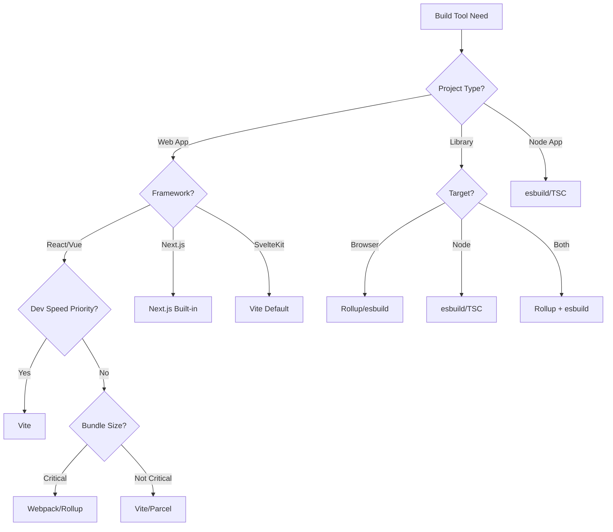

# Build Tool Selection Matrix

## Table of Contents

1. [Quick Decision Flow](#quick-decision-flow)
2. [Requirements Gathering](#requirements-gathering)
  3. [Project Requirements](#project-requirements)
  4. [Technical Requirements](#technical-requirements)
5. [Options Evaluation Matrix](#options-evaluation-matrix)
  6. [Modern Build Tools Comparison](#modern-build-tools-comparison)
  7. [Feature Comparison Matrix](#feature-comparison-matrix)
8. [Detailed Comparison](#detailed-comparison)
  9. [Option A: Vite (Modern Default)](#option-a-vite-modern-default)
  10. [Option B: esbuild (Speed Champion)](#option-b-esbuild-speed-champion)
  11. [Option C: Webpack 5 (Enterprise Standard)](#option-c-webpack-5-enterprise-standard)
  12. [Option D: Parcel 2 (Zero Config)](#option-d-parcel-2-zero-config)
13. [Performance Benchmarks](#performance-benchmarks)
  14. [Build Time Comparison (Medium React App)](#build-time-comparison-medium-react-app)
  15. [Bundle Size Comparison](#bundle-size-comparison)
16. [Local Development Optimization](#local-development-optimization)
  17. [Vite Optimization Tips](#vite-optimization-tips)
  18. [esbuild Speed Tricks](#esbuild-speed-tricks)
  19. [Development Workflow Integration](#development-workflow-integration)
20. [Migration Guide](#migration-guide)
  21. [From Create React App to Vite](#from-create-react-app-to-vite)
  22. [Webpack to Vite Plugin Mapping](#webpack-to-vite-plugin-mapping)
23. [Decision Template](#decision-template)
24. [Common Issues & Solutions](#common-issues-solutions)
25. [Tool Selection by Project Type](#tool-selection-by-project-type)
  26. [SPA (React/Vue/Svelte)](#spa-reactvuesvelte)
  27. [Static Site Generator](#static-site-generator)
  28. [Component Library](#component-library)
  29. [Node.js Application](#nodejs-application)
  30. [Electron App](#electron-app)
31. [AI Assistant Integration](#ai-assistant-integration)
  32. [Build Tool Selection Prompt](#build-tool-selection-prompt)
  33. [Configuration Generation](#configuration-generation)

## Quick Decision Flow



## Requirements Gathering

### Project Requirements

- [ ] Project type (app, library, CLI tool, monorepo)
- [ ] Target environment (browser, node, both)
- [ ] Framework requirements (React, Vue, Svelte, vanilla)
- [ ] TypeScript usage and strictness
- [ ] Bundle size constraints
- [ ] Development speed priority
- [ ] Legacy browser support needs

### Technical Requirements

- [ ] Hot Module Replacement (HMR) speed
- [ ] Build time requirements (<10s, <30s, <1min)
- [ ] Code splitting needs
- [ ] CSS processing (modules, PostCSS, Sass)
- [ ] Asset handling (images, fonts, workers)
- [ ] Plugin ecosystem requirements
- [ ] Source map requirements

## Options Evaluation Matrix

### Modern Build Tools Comparison

| Criteria                | Vite       | Webpack 5  | Parcel 2   | esbuild    | Rollup     | Turbopack  |
| ----------------------- | ---------- | ---------- | ---------- | ---------- | ---------- | ---------- |
| Dev Server Speed (25%)  | 10/10      | 6/10       | 8/10       | 9/10       | 5/10       | 10/10      |
| Build Performance (20%) | 9/10       | 7/10       | 8/10       | 10/10      | 7/10       | 10/10      |
| Configuration (15%)     | 9/10       | 6/10       | 10/10      | 8/10       | 7/10       | 8/10       |
| Ecosystem (15%)         | 8/10       | 10/10      | 7/10       | 6/10       | 9/10       | 5/10       |
| Features (15%)          | 9/10       | 10/10      | 8/10       | 6/10       | 8/10       | 8/10       |
| Stability (10%)         | 9/10       | 10/10      | 8/10       | 9/10       | 9/10       | 6/10       |
| **Total Score**         | **9.0/10** | **8.0/10** | **8.3/10** | **8.0/10** | **7.5/10** | **8.1/10** |

### Feature Comparison Matrix

| Feature        | Vite        | Webpack   | Parcel      | esbuild   | Rollup    | Turbopack   |
| -------------- | ----------- | --------- | ----------- | --------- | --------- | ----------- |
| HMR            | ✅ Instant  | ✅ Good   | ✅ Good     | ⚠️ Basic  | ❌ Plugin | ✅ Instant  |
| TypeScript     | ✅ Native   | ✅ Loader | ✅ Native   | ✅ Native | ⚠️ Plugin | ✅ Native   |
| CSS Modules    | ✅ Built-in | ✅ Loader | ✅ Built-in | ⚠️ Plugin | ⚠️ Plugin | ✅ Built-in |
| Code Splitting | ✅ Auto     | ✅ Manual | ✅ Auto     | ⚠️ Basic  | ✅ Manual | ✅ Auto     |
| Tree Shaking   | ✅ Yes      | ✅ Yes    | ✅ Yes      | ✅ Yes    | ✅ Optimal   | ✅ Yes      |
| Workers        | ✅ Native   | ✅ Loader | ✅ Native   | ⚠️ Manual | ⚠️ Plugin | ✅ Native   |
| WASM           | ✅ Native   | ✅ Loader | ✅ Native   | ❌ No     | ⚠️ Plugin | ✅ Native   |

## Detailed Comparison

### Option A: Vite (Modern Default)

**When to use:**

- New projects without legacy constraints
- Vue, React, Svelte applications
- Development speed is priority
- Want minimal configuration
- Need fast HMR for large codebases

**When NOT to use:**

- Complex webpack-specific setups
- Need specific webpack loaders
- Require Module Federation
- Legacy browser support (IE11)

**Example Implementation:**

```javascript
// vite.config.js
import { defineConfig } from "vite";
import react from "@vitejs/plugin-react";
import { visualizer } from "rollup-plugin-visualizer";

export default defineConfig({
  plugins: [react(), visualizer({ open: true, gzipSize: true })],
  server: {
    port: 3000,
    open: true,
  },
  build: {
    target: "es2015",
    sourcemap: true,
    rollupOptions: {
      output: {
        manualChunks: {
          vendor: ["react", "react-dom"],
          utils: ["lodash", "date-fns"],
        },
      },
    },
  },
  optimizeDeps: {
    include: ["react", "react-dom"],
  },
});
```

**Migration from Webpack:**

```bash
# Install Vite
npm install -D vite @vitejs/plugin-react

# Convert webpack.config.js to vite.config.js
# Update package.json scripts
# Move index.html to root
# Update imports to use .tsx extensions
```

### Option B: esbuild (Speed Champion)

**When to use:**

- Build performance is critical
- Simple bundling needs
- Node.js applications
- CI/CD optimization
- Library bundling

**When NOT to use:**

- Need advanced features (HMR, CSS modules)
- Complex plugin requirements
- Development server needed
- Extensive browser compatibility

**Example Implementation:**

```javascript
// build.js
const esbuild = require("esbuild");

// Development build
async function buildDev() {
  const ctx = await esbuild.context({
    entryPoints: ["src/index.ts"],
    bundle: true,
    outdir: "dist",
    platform: "node",
    target: "node18",
    sourcemap: true,
    format: "esm",
    watch: {
      onRebuild(error, result) {
        if (error) console.error("watch build failed:", error);
        else console.log("watch build succeeded:", result);
      },
    },
  });

  await ctx.watch();
}

// Production build
esbuild.build({
  entryPoints: ["src/index.ts"],
  bundle: true,
  minify: true,
  outfile: "dist/bundle.js",
  platform: "browser",
  target: ["chrome90", "firefox88", "safari14"],
  define: {
    "process.env.NODE_ENV": '"production"',
  },
});
```

### Option C: Webpack 5 (Enterprise Standard)

**When to use:**

- Existing webpack projects
- Need Module Federation
- Complex build requirements
- Extensive plugin ecosystem needed
- Enterprise applications

**When NOT to use:**

- Starting fresh project
- Want fast development experience
- Minimal configuration desired
- Small to medium projects

**Example Implementation:**

```javascript
// webpack.config.js
const HtmlWebpackPlugin = require("html-webpack-plugin");
const ReactRefreshWebpackPlugin = require("@pmmmwh/react-refresh-webpack-plugin");

module.exports = (env, argv) => {
  const isDev = argv.mode === "development";

  return {
    entry: "./src/index.tsx",
    module: {
      rules: [
        {
          test: /\.tsx?$/,
          use: [
            isDev && {
              loader: "babel-loader",
              options: {
                plugins: ["react-refresh/babel"],
              },
            },
            "ts-loader",
          ].filter(Boolean),
        },
        {
          test: /\.css$/,
          use: ["style-loader", "css-loader", "postcss-loader"],
        },
      ],
    },
    plugins: [
      new HtmlWebpackPlugin({
        template: "./public/index.html",
      }),
      isDev && new ReactRefreshWebpackPlugin(),
    ].filter(Boolean),
    optimization: {
      splitChunks: {
        chunks: "all",
        cacheGroups: {
          vendor: {
            test: /[\\/]node_modules[\\/]/,
            priority: 10,
          },
        },
      },
    },
  };
};
```

### Option D: Parcel 2 (Zero Config)

**When to use:**

- Want zero configuration
- Prototyping and experiments
- Multi-page applications
- Mixed asset types
- Beginner-friendly setup

**When NOT to use:**

- Need fine control over bundling
- Complex optimization requirements
- Specific plugin ecosystem
- Large-scale applications

**Example Implementation:**

```json
// package.json
{
  "source": "src/index.html",
  "scripts": {
    "dev": "parcel",
    "build": "parcel build"
  },
  "targets": {
    "main": {
      "optimize": true,
      "sourceMap": true
    }
  }
}
```

```javascript
// .parcelrc (optional for customization)
{
  "extends": "@parcel/config-default",
  "transformers": {
    "*.{ts,tsx}": ["@parcel/transformer-typescript-tsc"]
  },
  "optimizers": {
    "*.js": ["@parcel/optimizer-esbuild"]
  }
}
```

## Performance Benchmarks

### Build Time Comparison (Medium React App)

```text
| Tool       | Cold Start | Hot Reload | Production Build |
|------------|------------|------------|------------------|
| Vite       | 1.2s       | 50ms       | 8s               |
| esbuild    | 0.3s       | 30ms       | 2s               |
| Webpack 5  | 8s         | 800ms      | 25s              |
| Parcel 2   | 5s         | 300ms      | 15s              |
| Rollup     | 3s         | N/A        | 12s              |
| Turbopack  | 0.8s       | 40ms       | 5s               |
```

### Bundle Size Comparison

```javascript
// Same app built with different tools
const bundleSizes = {
  vite: {
    js: "142kb",
    css: "23kb",
    gzip: "48kb",
  },
  webpack: {
    js: "145kb",
    css: "24kb",
    gzip: "49kb",
  },
  parcel: {
    js: "148kb",
    css: "23kb",
    gzip: "50kb",
  },
  rollup: {
    js: "138kb", // Optimal tree-shaking
    css: "23kb",
    gzip: "46kb",
  },
};
```

## Local Development Optimization

### Vite Optimization Tips

```javascript
// vite.config.js
export default {
  server: {
    // Faster HMR
    hmr: {
      overlay: false,
    },
    // Pre-transform heavy deps
    warmup: {
      clientFiles: ["./src/app.tsx", "./src/components/**/*"],
    },
  },
  optimizeDeps: {
    // Pre-bundle large dependencies
    include: ["react", "react-dom", "lodash-es"],
    // Exclude problematic deps
    exclude: ["@local/shared-ui"],
  },
};
```

### esbuild Speed Tricks

```javascript
// Parallel builds
const builds = [
  { entryPoints: ["src/app.ts"], outfile: "dist/app.js" },
  { entryPoints: ["src/worker.ts"], outfile: "dist/worker.js" },
];

await Promise.all(
  builds.map((config) =>
    esbuild.build({
      ...commonConfig,
      ...config,
    }),
  ),
);
```

### Development Workflow Integration

```json
// package.json scripts
{
  "scripts": {
    "dev": "vite",
    "dev:debug": "vite --debug --force",
    "build": "vite build",
    "build:analyze": "vite build --mode analyze",
    "preview": "vite preview",
    "type-check": "tsc --noEmit",
    "clean": "rm -rf dist .vite node_modules/.vite"
  }
}
```

## Migration Guide

### From Create React App to Vite

```bash
# 1. Install Vite
npm install -D vite @vitejs/plugin-react

# 2. Create vite.config.js
# 3. Move index.html to root
# 4. Update index.html
#    - Remove %PUBLIC_URL%
#    - Add <script type="module" src="/src/index.tsx"></script>

# 5. Update tsconfig.json
{
  "compilerOptions": {
    "target": "ESNext",
    "useDefineForClassFields": true,
    "module": "ESNext",
    "lib": ["ESNext", "DOM"]
  }
}

# 6. Update imports (add extensions)
# 7. Handle environment variables (import.meta.env)
```

### Webpack to Vite Plugin Mapping

| Webpack                 | Vite Equivalent          |
| ----------------------- | ------------------------ |
| html-webpack-plugin     | Built-in                 |
| mini-css-extract-plugin | Built-in                 |
| copy-webpack-plugin     | vite-plugin-static-copy  |
| webpack-bundle-analyzer | rollup-plugin-visualizer |
| dotenv-webpack          | Built-in                 |
| workbox-webpack-plugin  | vite-plugin-pwa          |

## Decision Template

**Selected Tool:** Vite

**Rationale:**

- Instant HMR crucial for developer productivity
- Modern browser target (no IE11)
- Minimal configuration reduces maintenance
- Strong ecosystem for React/Vue/Svelte
- Native TypeScript and JSX support

**Implementation Plan:**

1. Install Vite and framework plugin
2. Create minimal vite.config.js
3. Migrate build scripts
4. Update CI/CD pipelines
5. Optimize for specific needs

**Fallback Options:**

- esbuild for Node.js services
- Webpack for complex legacy needs
- Parcel for quick prototypes

**Review Date:** After first production deployment

## Common Issues & Solutions

| Issue                        | Solution                             |
| ---------------------------- | ------------------------------------ |
| Vite dev/prod inconsistency  | Use same target, check optimizeDeps  |
| Large dependency prebundling | Add to optimizeDeps.include          |
| Memory issues with HMR       | Disable HMR overlay, limit fs.allow  |
| CSS module conflicts         | Use consistent naming convention     |
| Build size regression        | Enable build.rollupOptions.treeshake |

## Tool Selection by Project Type

### SPA (React/Vue/Svelte)

**Recommended:** Vite
**Alternative:** Parcel 2
**Why:** Fast HMR, effective DX, minimal config

### Static Site Generator

**Recommended:** Framework default (Next.js, Gatsby)
**Alternative:** Vite + vite-plugin-ssr
**Why:** Optimized for SSG use case

### Component Library

**Recommended:** Rollup + esbuild
**Alternative:** Vite library mode
**Why:** Optimal tree-shaking, multiple formats

### Node.js Application

**Recommended:** esbuild
**Alternative:** Native TypeScript (tsc)
**Why:** Fastest builds, minimal overhead

### Electron App

**Recommended:** Vite + electron-vite
**Alternative:** Webpack
**Why:** Fast rebuilds, good electron integration

## AI Assistant Integration

### Build Tool Selection Prompt

```markdown
When choosing a build tool:

1. Identify project type from package.json
2. Check for framework-specific requirements
3. Assess team's configuration tolerance
4. Default to Vite for new web projects
5. Suggest esbuild for Node.js/CLI tools
```

### Configuration Generation

```markdown
"Generate optimal [TOOL] configuration for:

- Framework: [React/Vue/Svelte/Vanilla]
- TypeScript: [Yes/No]
- CSS: [Modules/PostCSS/Sass/Tailwind]
- Features: [PWA/Workers/WASM]
  Include dev and production optimizations."
```
