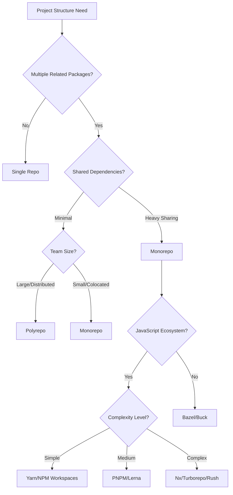

# Monorepo Architecture Decision Matrix

## Quick Decision Flow



## Requirements Gathering

### Project Structure Requirements

- [ ] Number of packages/applications
- [ ] Shared code percentage (>30% suggests monorepo)
- [ ] Deployment independence requirements
- [ ] Team size and distribution
- [ ] Build time constraints
- [ ] Development workflow preferences
- [ ] CI/CD complexity tolerance

### Technical Requirements

- [ ] Language/framework consistency
- [ ] Versioning strategy (locked vs independent)
- [ ] Publishing requirements (npm packages?)
- [ ] Build caching needs
- [ ] Test execution strategy
- [ ] IDE performance requirements
- [ ] Git repository size limits

## Options Evaluation Matrix

### Monorepo Tools Comparison

| Criteria                | Nx         | Turborepo  | Lerna      | Rush       | PNPM Workspaces | Yarn Workspaces |
| ----------------------- | ---------- | ---------- | ---------- | ---------- | --------------- | --------------- |
| Build Performance (25%) | 10/10      | 9/10       | 6/10       | 9/10       | 7/10            | 6/10            |
| Caching (20%)           | 10/10      | 10/10      | 5/10       | 9/10       | 6/10            | 5/10            |
| Learning Curve (15%)    | 6/10       | 8/10       | 9/10       | 5/10       | 9/10            | 10/10           |
| Ecosystem (15%)         | 9/10       | 8/10       | 7/10       | 8/10       | 8/10            | 9/10            |
| Tooling (15%)           | 10/10      | 7/10       | 6/10       | 8/10       | 7/10            | 6/10            |
| Maintenance (10%)       | 8/10       | 9/10       | 7/10       | 7/10       | 9/10            | 8/10            |
| **Total Score**         | **9.0/10** | **8.5/10** | **6.5/10** | **7.8/10** | **7.5/10**      | **7.3/10**      |

### Monorepo vs Polyrepo Decision Matrix

| Factor                | Monorepo Better               | Polyrepo Better                  |
| --------------------- | ----------------------------- | -------------------------------- |
| Code Sharing          | ✅ Extensive shared code      | ❌ Minimal shared code           |
| Team Structure        | ✅ Single team/product        | ❌ Multiple independent teams    |
| Release Cycle         | ✅ Coordinated releases       | ❌ Independent release schedules |
| Dependency Management | ✅ Consistent versions needed | ❌ Version flexibility required  |
| Build Times           | ❌ Can optimize with caching  | ✅ Naturally isolated            |
| Repository Size       | ❌ Can grow large             | ✅ Stays manageable              |
| Access Control        | ❌ All-or-nothing             | ✅ Fine-grained permissions      |
| CI/CD Complexity      | ❌ More complex setup         | ✅ Simple, isolated pipelines    |

## Detailed Comparison

### Option A: Nx (Enterprise-Grade Monorepo)

**When to use:**

- Large applications with multiple frontend/backend apps
- Need computation caching and distributed builds
- Want powerful code generation and migration tools
- Team can invest in learning comprehensive tooling

**When NOT to use:**

- Simple projects with few packages
- Team unfamiliar with monorepo concepts
- Need minimal configuration overhead
- Working with non-JS languages primarily

**Example Implementation:**

```json
// nx.json
{
  "extends": "nx/presets/npm.json",
  "tasksRunnerOptions": {
    "default": {
      "runner": "nx/tasks-runners/default",
      "options": {
        "cacheableOperations": ["build", "test", "lint"],
        "parallel": 3,
        "cacheDirectory": ".nx/cache"
      }
    }
  },
  "targetDefaults": {
    "build": {
      "dependsOn": ["^build"],
      "outputs": ["{projectRoot}/dist"]
    }
  }
}
```

**Migration Path:**

```bash
npx nx@latest init
npx nx g @nx/workspace:move --project oldProject --destination packages/oldProject
npx nx g @nx/workspace:library shared-utils
```

### Option B: Turborepo (Vercel's High-Performance Build)

**When to use:**

- Focus on build performance and caching
- Want simpler setup than Nx
- Already using Vercel ecosystem
- Need remote caching capabilities

**When NOT to use:**

- Need extensive code generation tools
- Want rich plugin ecosystem
- Require complex task orchestration
- Non-JavaScript projects

**Example Implementation:**

```json
// turbo.json
{
  "$schema": "https://turbo.build/schema.json",
  "pipeline": {
    "build": {
      "dependsOn": ["^build"],
      "outputs": ["dist/**", ".next/**"],
      "cache": true
    },
    "test": {
      "dependsOn": ["build"],
      "cache": true
    },
    "dev": {
      "cache": false,
      "persistent": true
    }
  },
  "globalEnv": ["NODE_ENV"],
  "globalDependencies": ["tsconfig.json"]
}
```

### Option C: PNPM Workspaces (Lightweight & Efficient)

**When to use:**

- Want minimal configuration
- Need efficient disk space usage
- Simple monorepo without complex tooling
- Prefer native package manager features

**When NOT to use:**

- Need advanced build orchestration
- Want computation caching
- Require code generation tools
- Complex deployment pipelines

**Example Implementation:**

```yaml
# pnpm-workspace.yaml
packages:
  - "packages/*"
  - "apps/*"
  - "tools/*"
```

```json
// .npmrc
shamefully-hoist=true
strict-peer-dependencies=false
auto-install-peers=true
```

### Option D: Yarn Workspaces (Simple & Native)

**When to use:**

- Starting with monorepo concepts
- Want zero additional tooling
- Simple package structure
- Already using Yarn

**When NOT to use:**

- Need build optimization
- Want sophisticated caching
- Require task orchestration
- Performance is critical

**Example Implementation:**

```json
// package.json
{
  "private": true,
  "workspaces": ["packages/*", "apps/*"],
  "scripts": {
    "build": "yarn workspaces foreach -p run build",
    "test": "yarn workspaces foreach -p run test"
  }
}
```

## Implementation Patterns

### Pattern 1: Shared Configuration

```
monorepo/
├── packages/
│   ├── eslint-config/
│   ├── tsconfig/
│   └── prettier-config/
├── apps/
│   ├── web/
│   └── api/
└── tools/
    └── scripts/
```

### Pattern 2: Shared Component Library

```typescript
// packages/ui/package.json
{
  "name": "@myproject/ui",
  "version": "1.0.0",
  "main": "./dist/index.js",
  "types": "./dist/index.d.ts"
}

// apps/web/package.json
{
  "dependencies": {
    "@myproject/ui": "workspace:*"
  }
}
```

### Pattern 3: Cross-Package Scripts

```json
// root package.json
{
  "scripts": {
    "dev": "turbo run dev",
    "build": "turbo run build",
    "test": "turbo run test",
    "clean": "turbo run clean && rm -rf node_modules",
    "format": "prettier --write \"**/*.{ts,tsx,md}\"",
    "changeset": "changeset",
    "version-packages": "changeset version",
    "release": "turbo run build && changeset publish"
  }
}
```

## Local Development Optimization

### VSCode Settings for Monorepo

```json
// .vscode/settings.json
{
  "typescript.tsdk": "node_modules/typescript/lib",
  "typescript.enablePromptUseWorkspaceTsdk": true,
  "editor.formatOnSave": true,
  "search.exclude": {
    "**/node_modules": true,
    "**/dist": true,
    "**/.turbo": true,
    "**/.nx": true
  },
  "files.watcherExclude": {
    "**/target": true,
    "**/dist": true,
    "**/node_modules": true
  }
}
```

### Git Configuration

```gitignore
# .gitignore
node_modules/
dist/
.turbo/
.nx/
*.log
.DS_Store
coverage/
.env.local

# Tool specific
.parcel-cache/
.next/
out/
build/
```

### Performance Tips

```bash
# Enable caching
echo ".turbo" >> .gitignore
echo ".nx" >> .gitignore

# Use sparse checkout for large monorepos
git sparse-checkout init --cone
git sparse-checkout set packages/mypackage apps/myapp

# Optimize git for large repos
git config core.fsmonitor true
git config core.untrackedcache true
```

## Cost-Benefit Analysis

### Setup Costs

| Tool            | Initial Setup Time | Learning Curve | Maintenance Overhead |
| --------------- | ------------------ | -------------- | -------------------- |
| Yarn Workspaces | 30 min             | Low            | Low                  |
| PNPM Workspaces | 1 hour             | Low            | Low                  |
| Turborepo       | 2-4 hours          | Medium         | Medium               |
| Nx              | 1-2 days           | High           | Medium               |
| Lerna           | 2-4 hours          | Medium         | High                 |
| Rush            | 1 day              | High           | Medium               |

### Long-term Benefits

```
Shared Code Savings = (Packages × Duplication %) × Dev Hours
Build Time Savings = (Sequential Time - Parallel Time) × Builds/Day
Consistency Value = Reduced Bugs × Fix Time × Team Size
```

## Migration Strategies

### From Polyrepo to Monorepo

```bash
# Step 1: Create monorepo structure
mkdir my-monorepo && cd my-monorepo
npm init -y
mkdir packages apps

# Step 2: Import existing repos
git subtree add --prefix=packages/package1 git@github.com:org/repo1.git main
git subtree add --prefix=packages/package2 git@github.com:org/repo2.git main

# Step 3: Setup monorepo tooling
npx create-turbo@latest
# or
npx create-nx-workspace@latest

# Step 4: Update imports and dependencies
# Step 5: Setup shared configurations
```

### From Monorepo to Polyrepo

```bash
# Extract package with history
git subtree split --prefix=packages/mypackage -b mypackage-branch
# Create new repo and push
```

## Decision Template

**Selected Architecture:** Monorepo
**Selected Tool:** Turborepo

**Rationale:**

- 5+ related packages with 40% shared code
- Need build performance optimization
- Team familiar with Vercel ecosystem
- Balance of features vs complexity

**Implementation Plan:**

1. Setup Turborepo with workspace structure
2. Migrate shared code to packages/
3. Configure caching and parallel builds
4. Update CI/CD for monorepo

**Risk Mitigation:**

- Start with 2 packages, gradually migrate others
- Keep polyrepo fallback scripts
- Document monorepo workflows thoroughly
- Regular team training sessions

**Review Date:** After 3rd package migration

## Real-World Examples

### Example 1: E-commerce Platform

**Context**: Frontend, admin, API, shared components
**Solution**: Nx with strict boundaries
**Result**: 60% faster builds, 90% code reuse

### Example 2: SaaS Startup

**Context**: Web app, mobile app, backend services
**Solution**: Turborepo with remote caching
**Result**: 10x faster CI builds, simplified deployments

### Example 3: Open Source UI Library

**Context**: Core library, React bindings, Vue bindings, docs
**Solution**: PNPM workspaces with changesets
**Result**: Easy contributor setup, automated releases

## Common Pitfalls & Solutions

| Pitfall              | Solution                                         |
| -------------------- | ------------------------------------------------ |
| Slow IDE performance | Use sparse checkout, exclude folders             |
| Long CI times        | Implement affected builds, remote caching        |
| Merge conflicts      | Clear ownership boundaries, automated formatting |
| Large repo size      | Git LFS for binaries, history pruning            |
| Complex debugging    | Workspace-specific launch configs                |

## AI Assistant Integration

### For Monorepo Decisions

```markdown
When evaluating monorepo needs:

1. Use Requirements Gathering checklist first
2. If >3 "yes" answers in "Monorepo Better" column, recommend monorepo
3. Match complexity level to tool selection
4. Provide migration script examples
```

### Prompt Templates

```markdown
"Setup a monorepo using [TOOL] for a project with:

- [x] packages
- [List key requirements]
- [Deployment targets]
  Provide complete configuration files and folder structure."
```
