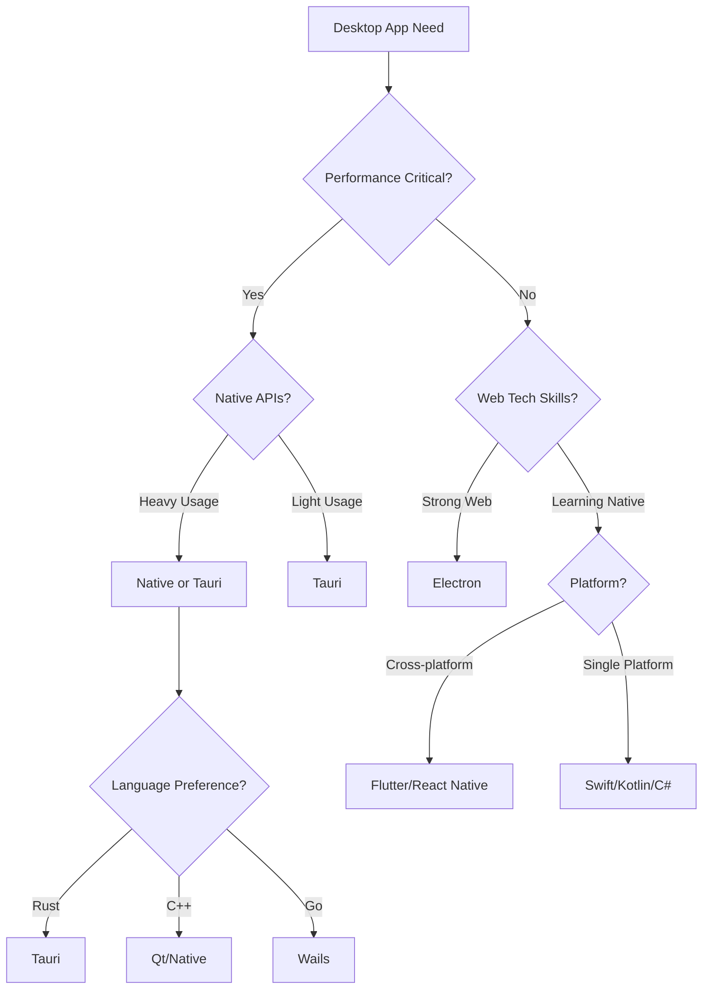

# Desktop Application Patterns Guide

## Quick Decision Flow



## Requirements Gathering

### Application Requirements

- [ ] Target platforms (Windows, macOS, Linux)
- [ ] Performance requirements (startup time, memory usage)
- [ ] Native API access needs (file system, notifications, tray)
- [ ] UI complexity (simple forms vs rich interactions)
- [ ] Offline capability requirements
- [ ] Auto-update mechanism needed
- [ ] Code signing and distribution method

### Technical Requirements

- [ ] Team expertise (web vs native development)
- [ ] Development timeline constraints
- [ ] Bundle size limitations
- [ ] Security requirements (sandbox, permissions)
- [ ] Integration with existing codebase
- [ ] Debugging and profiling needs
- [ ] CI/CD pipeline compatibility

## Options Evaluation Matrix

### Desktop Framework Comparison

| Criteria             | Electron   | Tauri      | Flutter    | React Native | Native     |
| -------------------- | ---------- | ---------- | ---------- | ------------ | ---------- |
| Performance (25%)    | 6/10       | 9/10       | 8/10       | 7/10         | 10/10      |
| Dev Experience (20%) | 9/10       | 8/10       | 7/10       | 8/10         | 6/10       |
| Bundle Size (15%)    | 4/10       | 10/10      | 7/10       | 6/10         | 9/10       |
| Native APIs (15%)    | 8/10       | 9/10       | 7/10       | 7/10         | 10/10      |
| Ecosystem (15%)      | 10/10      | 7/10       | 8/10       | 9/10         | 8/10       |
| Cross-platform (10%) | 10/10      | 10/10      | 10/10      | 9/10         | 5/10       |
| **Total Score**      | **7.7/10** | **8.8/10** | **7.8/10** | **7.7/10**   | **8.2/10** |

### Resource Usage Comparison

| Framework | RAM Usage | Disk Size | Startup Time | CPU Idle |
| --------- | --------- | --------- | ------------ | -------- |
| Electron  | 150-300MB | 50-150MB  | 1-3s         | 1-3%     |
| Tauri     | 30-80MB   | 5-15MB    | 0.1-0.5s     | 0-1%     |
| Flutter   | 80-150MB  | 20-40MB   | 0.5-1s       | 0-2%     |
| Native    | 20-50MB   | 2-10MB    | 0.1-0.3s     | 0%       |

## Detailed Comparison

### Option A: Electron (Web Technologies Champion)

**When to use:**

- Team has strong web development skills
- Need rapid prototyping and development
- Want to share code with web app
- Rich ecosystem of packages needed
- Complex UI with web frameworks

**When NOT to use:**

- Bundle size is critical (<20MB)
- Need native performance
- Target resource-constrained devices
- Require instant startup times

**Example Implementation:**

```javascript
// main.js (Main Process)
const { app, BrowserWindow, ipcMain } = require("electron");
const path = require("path");

let mainWindow;

function createWindow() {
  mainWindow = new BrowserWindow({
    width: 1200,
    height: 800,
    webPreferences: {
      preload: path.join(__dirname, "preload.js"),
      contextIsolation: true,
      nodeIntegration: false,
    },
    titleBarStyle: "hiddenInset",
    vibrancy: "dark",
  });

  if (process.env.NODE_ENV === "development") {
    mainWindow.loadURL("http://localhost:3000");
    mainWindow.webContents.openDevTools();
  } else {
    mainWindow.loadFile("dist/index.html");
  }
}

// Security-first setup
app.whenReady().then(() => {
  createWindow();

  // Handle protocol for deep linking
  app.setAsDefaultProtocolClient("myapp");
});

// Auto-updater setup
const { autoUpdater } = require("electron-updater");
autoUpdater.checkForUpdatesAndNotify();

// IPC handlers
ipcMain.handle("get-app-version", () => app.getVersion());
ipcMain.handle("read-user-file", async (event, filePath) => {
  // Validate file path for security
  const safePath = path.normalize(filePath);
  if (!safePath.startsWith(app.getPath("userData"))) {
    throw new Error("Invalid file path");
  }
  return fs.readFile(safePath, "utf8");
});
```

```javascript
// preload.js (Context Bridge)
const { contextBridge, ipcRenderer } = require("electron");

contextBridge.exposeInMainWorld("electronAPI", {
  getVersion: () => ipcRenderer.invoke("get-app-version"),
  readUserFile: (path) => ipcRenderer.invoke("read-user-file", path),
  onUpdateAvailable: (callback) => {
    ipcRenderer.on("update-available", callback);
  },
});
```

### Option B: Tauri (Rust-Powered Efficiency)

**When to use:**

- Performance and bundle size critical
- Want native look and feel
- Security is top priority
- Team comfortable with Rust
- Need efficient resource usage

**When NOT to use:**

- Need extensive Node.js packages
- Rapid prototyping required
- Team unfamiliar with Rust
- Complex native integrations

**Example Implementation:**

```rust
// src-tauri/src/main.rs
#![cfg_attr(
    all(not(debug_assertions), target_os = "windows"),
    windows_subsystem = "windows"
)]

use tauri::{CustomMenuItem, Menu, MenuItem, Submenu};

#[tauri::command]
fn greet(name: &str) -> String {
    format!("Hello, {}! You've been greeted from Rust!", name)
}

#[tauri::command]
async fn read_file(path: String) -> Result<String, String> {
    tokio::fs::read_to_string(path)
        .await
        .map_err(|e| e.to_string())
}

fn main() {
    // Create custom menu
    let quit = CustomMenuItem::new("quit".to_string(), "Quit");
    let close = CustomMenuItem::new("close".to_string(), "Close");
    let submenu = Submenu::new("File", Menu::new()
        .add_item(quit)
        .add_item(close));

    let menu = Menu::new()
        .add_native_item(MenuItem::Copy)
        .add_submenu(submenu);

    tauri::Builder::default()
        .menu(menu)
        .invoke_handler(tauri::generate_handler![greet, read_file])
        .run(tauri::generate_context!())
        .expect("error while running tauri application");
}
```

```javascript
// Frontend integration
import { invoke } from "@tauri-apps/api/tauri";
import { open } from "@tauri-apps/api/dialog";
import { readTextFile } from "@tauri-apps/api/fs";

// Call Rust function
const greeting = await invoke("greet", { name: "World" });

// Use Tauri APIs
const selected = await open({
  multiple: false,
  filters: [
    {
      name: "Text",
      extensions: ["txt", "md"],
    },
  ],
});

if (selected) {
  const contents = await readTextFile(selected);
}
```

### Option C: Flutter Desktop

**When to use:**

- Want single codebase for mobile + desktop
- Need custom UI/animations
- Team knows Dart/Flutter
- Consistent design across platforms

**When NOT to use:**

- Need web technology integration
- Want native platform UI
- Require extensive native APIs
- Small bundle size critical

**Example Implementation:**

```dart
// lib/main.dart
import 'package:flutter/material.dart';
import 'package:window_manager/window_manager.dart';
import 'package:file_picker/file_picker.dart';

void main() async {
  WidgetsFlutterBinding.ensureInitialized();

  // Configure window
  await windowManager.ensureInitialized();
  WindowOptions windowOptions = WindowOptions(
    size: Size(1200, 800),
    center: true,
    backgroundColor: Colors.transparent,
    skipTaskbar: false,
    titleBarStyle: TitleBarStyle.hidden,
  );

  windowManager.waitUntilReadyToShow(windowOptions, () async {
    await windowManager.show();
    await windowManager.focus();
  });

  runApp(MyApp());
}

class MyApp extends StatelessWidget {
  @override
  Widget build(BuildContext context) {
    return MaterialApp(
      title: 'Desktop App',
      theme: ThemeData(
        useMaterial3: true,
        colorScheme: ColorScheme.fromSeed(
          seedColor: Colors.blue,
          brightness: Brightness.light,
        ),
      ),
      home: HomePage(),
    );
  }
}
```

## Architecture Patterns

### Pattern 1: Main/Renderer Process Separation

```javascript
// Electron/Tauri pattern
// Main process: Native APIs, file system, security
// Renderer process: UI, user interaction

// Good: Security isolation
mainProcess.handle("save-file", async (event, data) => {
  // Validate and sanitize
  const sanitized = validateData(data);
  return await saveToFile(sanitized);
});

// Bad: Direct access
window.fs.writeFileSync(path, data); // Never do this!
```

### Pattern 2: State Management

```typescript
// Zustand for Electron/Tauri
import { create } from "zustand";
import { persist } from "zustand/middleware";

interface AppState {
  settings: Settings;
  updateSettings: (settings: Partial<Settings>) => void;
}

const useAppStore = create<AppState>()(
  persist(
    (set) => ({
      settings: defaultSettings,
      updateSettings: (newSettings) =>
        set((state) => ({
          settings: { ...state.settings, ...newSettings },
        })),
    }),
    {
      name: "app-storage",
      storage: {
        getItem: async (name) => {
          const value = await window.electronAPI.getStoreValue(name);
          return value ? JSON.parse(value) : null;
        },
        setItem: async (name, value) => {
          await window.electronAPI.setStoreValue(name, JSON.stringify(value));
        },
      },
    },
  ),
);
```

### Pattern 3: Auto-Update Implementation

```javascript
// Electron auto-updater
const { autoUpdater } = require('electron-updater')

autoUpdater.autoDownload = false
autoUpdater.autoInstallOnAppQuit = true

autoUpdater.on('update-available', (info) => {
  dialog.showMessageBox(mainWindow, {
    type: 'info',
    title: 'Update Available',
    message: `Version ${info.version} is available. Download now?`,
    buttons: ['Download', 'Later']
  }).then((result) => {
    if (result.response === 0) {
      autoUpdater.downloadUpdate()
    }
  })
})

// Tauri updater
use tauri::updater::builder;

tauri::Builder::default()
  .setup(|app| {
    let handle = app.handle();
    tauri::async_runtime::spawn(async move {
      match builder(handle).check().await {
        Ok(update) => {
          if update.is_update_available() {
            update.download_and_install().await.unwrap();
          }
        }
        Err(e) => {
          println!("Failed to check for updates: {}", e);
        }
      }
    });
    Ok(())
  })
```

## Local Development Setup

### Electron Development

```json
// package.json
{
  "scripts": {
    "start": "concurrently \"npm run dev:vite\" \"npm run dev:electron\"",
    "dev:vite": "vite",
    "dev:electron": "wait-on http://localhost:3000 && electron .",
    "build": "vite build && electron-builder",
    "dist": "vite build && electron-builder --publish=never"
  },
  "build": {
    "appId": "com.yourcompany.app",
    "productName": "YourApp",
    "directories": {
      "output": "dist-electron"
    },
    "mac": {
      "category": "public.app-category.productivity",
      "hardenedRuntime": true,
      "gatekeeperAssess": false,
      "entitlements": "build/entitlements.mac.plist",
      "entitlementsInherit": "build/entitlements.mac.plist"
    },
    "win": {
      "target": "nsis"
    },
    "linux": {
      "target": ["AppImage", "deb"]
    }
  }
}
```

### Tauri Development

```toml
# Cargo.toml
[dependencies]
tauri = { version = "1.5", features = ["shell-open", "dialog", "fs-all"] }
serde = { version = "1.0", features = ["derive"] }
serde_json = "1.0"
tokio = { version = "1", features = ["full"] }

[features]
default = ["custom-protocol"]
custom-protocol = ["tauri/custom-protocol"]

# tauri.conf.json
{
  "build": {
    "beforeBuildCommand": "npm run build",
    "beforeDevCommand": "npm run dev",
    "devPath": "http://localhost:3000",
    "distDir": "../dist"
  },
  "package": {
    "productName": "YourApp",
    "version": "0.1.0"
  },
  "tauri": {
    "allowlist": {
      "all": false,
      "shell": {
        "open": true
      },
      "dialog": {
        "all": true
      },
      "fs": {
        "scope": ["$APPDATA/*", "$DOCUMENT/*"]
      }
    },
    "bundle": {
      "active": true,
      "identifier": "com.yourcompany.app",
      "icon": ["icons/icon.png"],
      "resources": ["resources/*"]
    },
    "security": {
      "csp": "default-src 'self'; img-src 'self' data: https:; script-src 'self'"
    }
  }
}
```

## Security Best Practices

### Electron Security Checklist

```javascript
// ✅ Good practices
const win = new BrowserWindow({
  webPreferences: {
    contextIsolation: true, // Always true
    nodeIntegration: false, // Always false
    sandbox: true, // Enable sandbox
    webSecurity: true, // Never disable
    preload: path.join(__dirname, "preload.js"),
  },
});

// Context bridge for safe IPC
contextBridge.exposeInMainWorld("api", {
  // Only expose what's needed
  saveFile: (data) => ipcRenderer.invoke("save-file", data),
  // Never expose powerful APIs directly
  // ❌ fs: require('fs')
});

// Validate all IPC inputs
ipcMain.handle("save-file", async (event, data) => {
  // Validate data structure
  if (!isValidData(data)) {
    throw new Error("Invalid data");
  }
  // Sanitize file paths
  const safePath = path.join(app.getPath("userData"), sanitize(data.filename));
  return await fs.writeFile(safePath, data.content);
});
```

### Tauri Security Features

```rust
// Tauri is secure by default
// Commands must be explicitly exposed
#[tauri::command]
fn secure_file_read(app: AppHandle, filename: String) -> Result<String, String> {
    // Automatic path sandboxing
    let resource_path = app.path_resolver()
        .resolve_resource(filename)
        .ok_or("Failed to resolve resource")?;

    std::fs::read_to_string(resource_path)
        .map_err(|e| e.to_string())
}
```

## Performance Optimization

### Startup Time Optimization

```javascript
// Electron: Lazy loading
let mainWindow = null

app.on('ready', () => {
  // Show window immediately
  mainWindow = new BrowserWindow({
    show: false,
    backgroundColor: '#000'
  })

  mainWindow.once('ready-to-show', () => {
    mainWindow.show()
  })

  // Load heavy modules after window shows
  setTimeout(() => {
    require('./heavy-features')
  }, 100)
})

// Tauri: Smaller binaries
# .cargo/config.toml
[profile.release]
opt-level = 'z'     # Optimize for size
lto = true          # Link-time optimization
codegen-units = 1   # Single codegen unit
strip = true        # Strip symbols
```

### Memory Usage Optimization

```javascript
// Electron: Prevent memory leaks
class WindowManager {
  constructor() {
    this.windows = new Map()
  }

  createWindow(id) {
    const win = new BrowserWindow({...})

    win.on('closed', () => {
      this.windows.delete(id)
      // Clean up references
      global.gc && global.gc()
    })

    this.windows.set(id, win)
    return win
  }
}
```

## Distribution & Code Signing

### macOS Notarization

```bash
# Electron Builder config
{
  "mac": {
    "hardenedRuntime": true,
    "gatekeeperAssess": false,
    "entitlements": "build/entitlements.mac.plist",
    "entitlementsInherit": "build/entitlements.mac.plist",
    "notarize": {
      "teamId": "TEAM_ID"
    }
  },
  "afterSign": "scripts/notarize.js"
}
```

### Windows Code Signing

```javascript
// electron-builder.yml
win: certificateFile: "${env.WINDOWS_CERTIFICATE_FILE}";
certificatePassword: "${env.WINDOWS_CERTIFICATE_PASSWORD}";
signDlls: true;
signingHashAlgorithms: ["sha256"];
```

## Decision Template

**Selected Framework:** Tauri

**Rationale:**

- Minimal resource usage critical for always-on app
- Small bundle size (< 15MB vs Electron's 50MB+)
- Better security model by default
- Native performance for file operations
- Rust learning investment worthwhile

**Migration Strategy:**

- Start with web app in Tauri wrapper
- Gradually move performance-critical parts to Rust
- Keep Electron as fallback for complex features

**Risk Mitigation:**

- Maintain web version for compatibility
- Document Rust patterns for team
- Use Tauri's JS APIs initially
- Plan for native feature additions

**Review Date:** After 1000 users

## Real-World Examples

### Example 1: Note-Taking App

**Framework**: Tauri
**Result**: 8MB installer, 35MB RAM, instant startup
**Key**: Local SQLite, native file handling

### Example 2: Design Tool

**Framework**: Electron
**Result**: Rich UI, plugin system, 180MB RAM
**Key**: Web tech flexibility, npm ecosystem

### Example 3: System Monitor

**Framework**: Native (Rust + egui)
**Result**: 2MB binary, 15MB RAM, 0% idle CPU
**Key**: Maximum efficiency, system integration

## AI Assistant Integration

### Desktop App Planning Prompt

```markdown
When planning desktop app:

1. Check performance requirements first
2. Assess native API needs
3. Consider team expertise
4. Default to Tauri for new projects
5. Use Electron for complex web ports
```

### Code Generation Context

```markdown
"Generate [Electron/Tauri] desktop app with:

- Framework: [React/Vue/Svelte]
- Features: [tray icon, auto-update, file handling]
- Platforms: [Windows, macOS, Linux]
  Include security best practices and platform-specific code."
```
