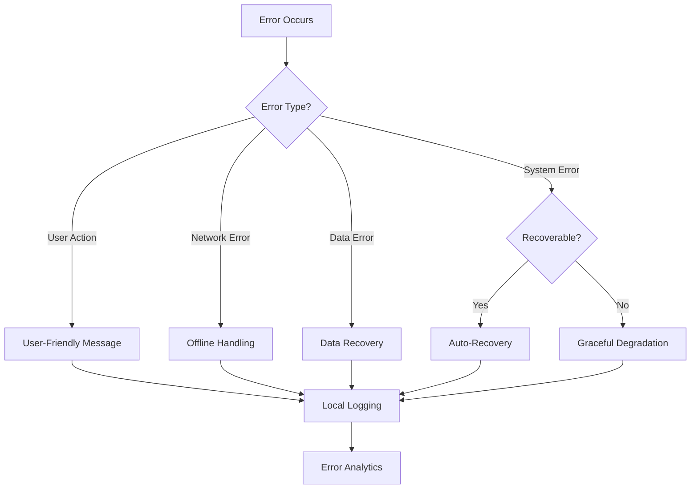

# Local Error Handling Guide

## Table of Contents

1. [Quick Decision Flow](#quick-decision-flow)
2. [Requirements Gathering](#requirements-gathering)
  3. [Error Handling Requirements](#error-handling-requirements)
  4. [Technical Requirements](#technical-requirements)
5. [Error Handling Patterns](#error-handling-patterns)
  6. [Pattern 1: Centralized Error Management](#pattern-1-centralized-error-management)
  7. [Pattern 2: Local Error Storage](#pattern-2-local-error-storage)
  8. [Pattern 3: User-Friendly Error Messages](#pattern-3-user-friendly-error-messages)
  9. [Pattern 4: Offline Error Handling](#pattern-4-offline-error-handling)
  10. [Pattern 5: Data Recovery](#pattern-5-data-recovery)
11. [Error Analytics Without Cloud](#error-analytics-without-cloud)
  12. [Local Analytics Implementation](#local-analytics-implementation)
  13. [Visual Error Dashboard](#visual-error-dashboard)
14. [Crash Recovery](#crash-recovery)
  15. [Desktop App Crash Handler](#desktop-app-crash-handler)
  16. [Browser Crash Detection](#browser-crash-detection)
17. [Testing Error Handlers](#testing-error-handlers)
  18. [Unit Testing Errors](#unit-testing-errors)
19. [Optimal Practices](#optimal-practices)
  20. [Do's ✅](#dos-)
  21. [Don'ts ❌](#donts-)
22. [Decision Template](#decision-template)
23. [AI Assistant Integration](#ai-assistant-integration)
  24. [Error Handling Setup](#error-handling-setup)
  25. [Debugging Assistant](#debugging-assistant)

## Quick Decision Flow



## Requirements Gathering

### Error Handling Requirements

- [ ] Types of errors expected (network, file, parsing, validation)
- [ ] User experience requirements (silent recovery vs notifications)
- [ ] Data persistence needs during errors
- [ ] Offline operation requirements
- [ ] Error reporting without internet
- [ ] Debugging information needs
- [ ] Privacy constraints on error data

### Technical Requirements

- [ ] Local storage for error logs
- [ ] Error recovery strategies
- [ ] Crash reporting mechanism
- [ ] Performance impact tolerance
- [ ] Debug vs production behavior
- [ ] Error serialization format
- [ ] Log rotation strategy

## Error Handling Patterns

### Pattern 1: Centralized Error Management

```typescript
// src/lib/errors/error-manager.ts
import { z } from 'zod'

// Error type definitions
export enum ErrorCategory {
  USER_INPUT = 'USER_INPUT',
  SYSTEM = 'SYSTEM',
  NETWORK = 'NETWORK',
  DATA = 'DATA',
  UNKNOWN = 'UNKNOWN'
}

export interface AppError {
  id: string
  timestamp: Date
  category: ErrorCategory
  code: string
  message: string
  userMessage?: string
  context?: Record<string, any>
  stack?: string
  recoverable: boolean
  retryable: boolean
  retryCount?: number
}

// Error boundary for React
export class ErrorBoundary extends React.Component<
  { fallback: React.ComponentType<{ error: AppError }> },
  { error: AppError | null }
> {
  state = { error: null }

  static getDerivedStateFromError(error: Error): { error: AppError } {
    return {
      error: ErrorManager.getInstance().captureError(error)
    }
  }

  componentDidCatch(error: Error, errorInfo: React.ErrorInfo) {
    ErrorManager.getInstance().logError(error, {
      componentStack: errorInfo.componentStack
    })
  }

  render() {
    if (this.state.error) {
      return <this.props.fallback error={this.state.error} />
    }
    return this.props.children
  }
}

// Singleton error manager
export class ErrorManager {
  private static instance: ErrorManager
  private errors: AppError[] = []
  private localStorage: LocalErrorStorage

  static getInstance(): ErrorManager {
    if (!ErrorManager.instance) {
      ErrorManager.instance = new ErrorManager()
    }
    return ErrorManager.instance
  }

  captureError(
    error: Error | unknown,
    context?: Record<string, any>
  ): AppError {
    const appError = this.normalizeError(error, context)
    this.errors.push(appError)
    this.localStorage.save(appError)

    // Trigger recovery if possible
    if (appError.recoverable) {
      this.attemptRecovery(appError)
    }

    return appError
  }

  private normalizeError(
    error: Error | unknown,
    context?: Record<string, any>
  ): AppError {
    if (error instanceof Error) {
      return {
        id: generateId(),
        timestamp: new Date(),
        category: this.categorizeError(error),
        code: error.name,
        message: error.message,
        userMessage: this.getUserMessage(error),
        context,
        stack: error.stack,
        recoverable: this.isRecoverable(error),
        retryable: this.isRetryable(error)
      }
    }

    // Handle non-Error objects
    return {
      id: generateId(),
      timestamp: new Date(),
      category: ErrorCategory.UNKNOWN,
      code: 'UNKNOWN_ERROR',
      message: String(error),
      context,
      recoverable: false,
      retryable: false
    }
  }
}
```

### Pattern 2: Local Error Storage

```typescript
// src/lib/errors/local-storage.ts
interface ErrorStorageOptions {
  maxErrors: number;
  maxSizeMB: number;
  rotationDays: number;
}

export class LocalErrorStorage {
  private dbName = "app_errors";
  private db: IDBDatabase | null = null;

  constructor(private options: ErrorStorageOptions) {
    this.initDB();
  }

  private async initDB() {
    return new Promise<void>((resolve, reject) => {
      const request = indexedDB.open(this.dbName, 1);

      request.onerror = () => reject(request.error);
      request.onsuccess = () => {
        this.db = request.result;
        this.setupRotation();
        resolve();
      };

      request.onupgradeneeded = (event) => {
        const db = (event.target as IDBOpenDBRequest).result;

        if (!db.objectStoreNames.contains("errors")) {
          const store = db.createObjectStore("errors", {
            keyPath: "id",
            autoIncrement: false,
          });
          store.createIndex("timestamp", "timestamp");
          store.createIndex("category", "category");
          store.createIndex("code", "code");
        }
      };
    });
  }

  async save(error: AppError) {
    if (!this.db) await this.initDB();

    const transaction = this.db!.transaction(["errors"], "readwrite");
    const store = transaction.objectStore("errors");

    // Check storage limits
    await this.enforceStorageLimits();

    return store.add(error);
  }

  async query(filters: {
    category?: ErrorCategory;
    startDate?: Date;
    endDate?: Date;
    code?: string;
  }): Promise<AppError[]> {
    if (!this.db) await this.initDB();

    const transaction = this.db!.transaction(["errors"], "readonly");
    const store = transaction.objectStore("errors");

    let results: AppError[] = [];

    // Use appropriate index based on filter
    if (filters.category) {
      const index = store.index("category");
      const request = index.getAll(filters.category);
      results = await promisify(request);
    } else {
      const request = store.getAll();
      results = await promisify(request);
    }

    // Apply additional filters
    return results.filter((error) => {
      if (filters.startDate && error.timestamp < filters.startDate)
        return false;
      if (filters.endDate && error.timestamp > filters.endDate) return false;
      if (filters.code && error.code !== filters.code) return false;
      return true;
    });
  }

  private async enforceStorageLimits() {
    const errors = await this.query({});

    // Remove old errors
    const cutoffDate = new Date();
    cutoffDate.setDate(cutoffDate.getDate() - this.options.rotationDays);

    const toDelete = errors
      .filter((e) => e.timestamp < cutoffDate)
      .map((e) => e.id);

    // Check count limit
    if (errors.length > this.options.maxErrors) {
      const overflow = errors.length - this.options.maxErrors;
      const oldestErrors = errors
        .sort((a, b) => a.timestamp.getTime() - b.timestamp.getTime())
        .slice(0, overflow)
        .map((e) => e.id);
      toDelete.push(...oldestErrors);
    }

    // Delete errors
    if (toDelete.length > 0) {
      const transaction = this.db!.transaction(["errors"], "readwrite");
      const store = transaction.objectStore("errors");
      toDelete.forEach((id) => store.delete(id));
    }
  }
}
```

### Pattern 3: User-Friendly Error Messages

```typescript
// src/lib/errors/user-messages.ts
const errorMessages: Record<string, (error: AppError) => string> = {
  NETWORK_ERROR: () =>
    "Unable to connect. Please check your internet connection.",

  FILE_NOT_FOUND: (error) =>
    `The file "${error.context?.filename}" could not be found.`,

  PERMISSION_DENIED: () =>
    "You don't have permission to perform this action.",

  VALIDATION_ERROR: (error) =>
    error.context?.field
      ? `Invalid value for ${error.context.field}`
      : "Please check your input and try again.",

  DATABASE_ERROR: () =>
    "Unable to save your data. Your work is preserved locally.",

  QUOTA_EXCEEDED: () =>
    "Storage limit reached. Please free up some space.",

  DEFAULT: () =>
    "Something went wrong. Please try again."
}

export function getUserMessage(error: AppError): string {
  const messageFunc = errorMessages[error.code] || errorMessages.DEFAULT
  return messageFunc(error)
}

// React component for error display
export const ErrorNotification: React.FC<{ error: AppError }> = ({ error }) => {
  const [isExpanded, setIsExpanded] = useState(false)

  return (
    <div className="error-notification" role="alert">
      <div className="error-main">
        <Icon name="error" className="error-icon" />
        <div className="error-content">
          <p className="error-message">{error.userMessage}</p>
          {error.retryable && (
            <button onClick={() => retryOperation(error)}>
              Try Again
            </button>
          )}
        </div>
        <button
          className="error-expand"
          onClick={() => setIsExpanded(!isExpanded)}
          aria-label="Show details"
        >
          <Icon name={isExpanded ? 'collapse' : 'expand'} />
        </button>
      </div>

      {isExpanded && (
        <div className="error-details">
          <p>Error Code: {error.code}</p>
          <p>Time: {error.timestamp.toLocaleString()}</p>
          {process.env.NODE_ENV === 'development' && (
            <pre className="error-stack">{error.stack}</pre>
          )}
        </div>
      )}
    </div>
  )
}
```

### Pattern 4: Offline Error Handling

```typescript
// src/lib/errors/offline-handler.ts
export class OfflineErrorHandler {
  private queue: Map<string, QueuedOperation> = new Map();
  private isOnline = navigator.onLine;

  constructor() {
    window.addEventListener("online", () => this.handleOnline());
    window.addEventListener("offline", () => this.handleOffline());
  }

  async executeWithFallback<T>(
    operation: () => Promise<T>,
    fallback: () => T,
    options: {
      queueable?: boolean;
      cacheKey?: string;
      retryCount?: number;
    } = {},
  ): Promise<T> {
    try {
      if (!this.isOnline && options.queueable) {
        // Queue for later
        this.queueOperation(operation, options);
        return fallback();
      }

      return await operation();
    } catch (error) {
      if (this.isNetworkError(error)) {
        if (options.queueable) {
          this.queueOperation(operation, options);
        }
        return fallback();
      }
      throw error;
    }
  }

  private queueOperation(operation: () => Promise<any>, options: any) {
    const id = options.cacheKey || generateId();
    this.queue.set(id, {
      operation,
      timestamp: new Date(),
      retryCount: 0,
      maxRetries: options.retryCount || 3,
    });

    // Persist queue to IndexedDB
    this.persistQueue();
  }

  private async handleOnline() {
    this.isOnline = true;

    // Process queued operations
    for (const [id, item] of this.queue) {
      try {
        await item.operation();
        this.queue.delete(id);
      } catch (error) {
        item.retryCount++;
        if (item.retryCount >= item.maxRetries) {
          this.queue.delete(id);
          ErrorManager.getInstance().captureError(error, {
            queuedOperation: id,
            reason: "max_retries_exceeded",
          });
        }
      }
    }

    this.persistQueue();
  }
}
```

### Pattern 5: Data Recovery

```typescript
// src/lib/errors/data-recovery.ts
export class DataRecoveryService {
  private autosaveInterval = 30000; // 30 seconds
  private recoveryStorage = new RecoveryStorage();

  setupAutosave(getData: () => any, key: string): () => void {
    const interval = setInterval(() => {
      try {
        const data = getData();
        this.recoveryStorage.save(key, data);
      } catch (error) {
        console.error("Autosave failed:", error);
      }
    }, this.autosaveInterval);

    return () => clearInterval(interval);
  }

  async recover<T>(key: string): Promise<T | null> {
    try {
      return await this.recoveryStorage.get(key);
    } catch (error) {
      console.error("Recovery failed:", error);
      return null;
    }
  }

  async checkForRecovery(key: string): Promise<boolean> {
    const data = await this.recoveryStorage.get(key);
    return data !== null;
  }
}

class RecoveryStorage {
  private dbName = "app_recovery";

  async save(key: string, data: any) {
    const db = await this.openDB();
    const transaction = db.transaction(["recovery"], "readwrite");
    const store = transaction.objectStore("recovery");

    await store.put({
      key,
      data: JSON.stringify(data),
      timestamp: new Date(),
      version: 1,
    });
  }

  async get<T>(key: string): Promise<T | null> {
    const db = await this.openDB();
    const transaction = db.transaction(["recovery"], "readonly");
    const store = transaction.objectStore("recovery");

    const result = await promisify(store.get(key));
    if (!result) return null;

    // Check if data is too old (24 hours)
    const age = Date.now() - result.timestamp.getTime();
    if (age > 24 * 60 * 60 * 1000) {
      await this.delete(key);
      return null;
    }

    return JSON.parse(result.data);
  }

  async delete(key: string) {
    const db = await this.openDB();
    const transaction = db.transaction(["recovery"], "readwrite");
    const store = transaction.objectStore("recovery");
    await store.delete(key);
  }
}
```

## Error Analytics Without Cloud

### Local Analytics Implementation

```typescript
// src/lib/analytics/error-analytics.ts
export class LocalErrorAnalytics {
  async generateReport(startDate: Date, endDate: Date): Promise<ErrorReport> {
    const errors = await ErrorManager.getInstance().getErrors({
      startDate,
      endDate,
    });

    return {
      summary: {
        total: errors.length,
        byCategory: this.groupByCategory(errors),
        byCode: this.groupByCode(errors),
        timeline: this.createTimeline(errors),
        recoveryRate: this.calculateRecoveryRate(errors),
      },
      topErrors: this.getTopErrors(errors, 10),
      trends: this.analyzeTrends(errors),
      recommendations: this.generateRecommendations(errors),
    };
  }

  private groupByCategory(errors: AppError[]): Record<string, number> {
    return errors.reduce(
      (acc, error) => {
        acc[error.category] = (acc[error.category] || 0) + 1;
        return acc;
      },
      {} as Record<string, number>,
    );
  }

  private createTimeline(errors: AppError[]): TimelineData[] {
    // Group by hour
    const hourly = new Map<string, number>();

    errors.forEach((error) => {
      const hour = new Date(error.timestamp);
      hour.setMinutes(0, 0, 0);
      const key = hour.toISOString();
      hourly.set(key, (hourly.get(key) || 0) + 1);
    });

    return Array.from(hourly.entries())
      .map(([time, count]) => ({ time, count }))
      .sort((a, b) => a.time.localeCompare(b.time));
  }

  exportReport(report: ErrorReport): Blob {
    const csv = this.convertToCSV(report);
    return new Blob([csv], { type: "text/csv" });
  }
}
```

### Visual Error Dashboard

```typescript
// src/components/ErrorDashboard.tsx
export const ErrorDashboard: React.FC = () => {
  const [report, setReport] = useState<ErrorReport | null>(null)
  const [dateRange, setDateRange] = useState({
    start: new Date(Date.now() - 7 * 24 * 60 * 60 * 1000),
    end: new Date()
  })

  useEffect(() => {
    const analytics = new LocalErrorAnalytics()
    analytics.generateReport(dateRange.start, dateRange.end)
      .then(setReport)
  }, [dateRange])

  if (!report) return <Loading />

  return (
    <div className="error-dashboard">
      <h2>Error Analytics</h2>

      <div className="summary-cards">
        <Card title="Total Errors" value={report.summary.total} />
        <Card
          title="Recovery Rate"
          value={`${report.summary.recoveryRate}%`}
        />
      </div>

      <div className="charts">
        <TimelineChart data={report.summary.timeline} />
        <CategoryPieChart data={report.summary.byCategory} />
      </div>

      <div className="top-errors">
        <h3>Most Frequent Errors</h3>
        <ErrorTable errors={report.topErrors} />
      </div>

      <div className="recommendations">
        <h3>Recommendations</h3>
        {report.recommendations.map((rec, i) => (
          <Alert key={i} type="info">{rec}</Alert>
        ))}
      </div>

      <button onClick={() => exportErrorReport(report)}>
        Export Report
      </button>
    </div>
  )
}
```

## Crash Recovery

### Desktop App Crash Handler

```typescript
// For Electron apps
import { app, crashReporter, dialog } from "electron";

// Setup crash reporter
crashReporter.start({
  submitURL: "", // Empty for local-only
  uploadToServer: false,
  ignoreSystemCrashHandler: true,
  compress: true,
  extra: {
    version: app.getVersion(),
    platform: process.platform,
  },
});

// Handle crashes
app.on("gpu-process-crashed", (event, killed) => {
  console.error("GPU process crashed", { killed });
  // Restart GPU process
  app.relaunch();
  app.exit(0);
});

app.on("renderer-process-crashed", (event, webContents, killed) => {
  console.error("Renderer crashed", { killed });

  // Save crash data locally
  const crashData = {
    timestamp: new Date(),
    type: "renderer_crash",
    killed,
    url: webContents.getURL(),
  };

  saveCrashData(crashData);

  // Show user dialog
  dialog
    .showMessageBox({
      type: "error",
      title: "Application Error",
      message: "The application encountered an error and needs to restart.",
      buttons: ["Restart", "Quit"],
    })
    .then((result) => {
      if (result.response === 0) {
        app.relaunch();
      }
      app.exit(0);
    });
});

// Uncaught exception handler
process.on("uncaughtException", (error) => {
  console.error("Uncaught exception:", error);

  // Save error locally
  ErrorManager.getInstance().captureError(error, {
    type: "uncaught_exception",
    fatal: true,
  });

  // Graceful shutdown
  gracefulShutdown();
});
```

### Browser Crash Detection

```typescript
// src/lib/crash-detector.ts
export class CrashDetector {
  private readonly HEARTBEAT_KEY = "app_heartbeat";
  private readonly CRASH_KEY = "app_crash_detected";
  private heartbeatInterval: number | null = null;

  start() {
    // Check for previous crash
    this.checkForCrash();

    // Start heartbeat
    this.heartbeatInterval = window.setInterval(() => {
      localStorage.setItem(this.HEARTBEAT_KEY, Date.now().toString());
    }, 1000);

    // Clean shutdown handler
    window.addEventListener("beforeunload", () => {
      this.cleanShutdown();
    });
  }

  private checkForCrash() {
    const lastHeartbeat = localStorage.getItem(this.HEARTBEAT_KEY);

    if (lastHeartbeat) {
      const timeSinceHeartbeat = Date.now() - parseInt(lastHeartbeat);

      // If more than 5 seconds since last heartbeat, assume crash
      if (timeSinceHeartbeat > 5000) {
        this.handleCrashDetected();
      }
    }

    // Clear crash flag
    localStorage.removeItem(this.CRASH_KEY);
  }

  private handleCrashDetected() {
    // Mark crash detected
    localStorage.setItem(this.CRASH_KEY, "true");

    // Attempt to recover unsaved data
    const recovery = new DataRecoveryService();
    recovery.recoverAll().then((recovered) => {
      if (recovered.length > 0) {
        this.showRecoveryDialog(recovered);
      }
    });
  }

  private cleanShutdown() {
    if (this.heartbeatInterval) {
      clearInterval(this.heartbeatInterval);
    }
    localStorage.removeItem(this.HEARTBEAT_KEY);
  }
}
```

## Testing Error Handlers

### Unit Testing Errors

```typescript
// src/lib/errors/__tests__/error-manager.test.ts
describe('ErrorManager', () => {
  let errorManager: ErrorManager

  beforeEach(() => {
    errorManager = ErrorManager.getInstance()
    jest.clearAllMocks()
  })

  test('captures and categorizes errors correctly', () => {
    const networkError = new Error('Network request failed')
    networkError.name = 'NetworkError'

    const appError = errorManager.captureError(networkError)

    expect(appError.category).toBe(ErrorCategory.NETWORK)
    expect(appError.retryable).toBe(true)
    expect(appError.userMessage).toBe(
      'Unable to connect. Please check your internet connection.'
    )
  })

  test('handles recovery for recoverable errors', async () => {
    const recoverableError = new Error('Temporary failure')
    recoverableError.name = 'RecoverableError'

    const recoverySpy = jest.spyOn(errorManager, 'attemptRecovery')

    errorManager.captureError(recoverableError)

    expect(recoverySpy).toHaveBeenCalled()
  })

  test('enforces storage limits', async () => {
    // Generate many errors
    for (let i = 0; i < 1100; i++) {
      errorManager.captureError(new Error(`Error ${i}`))
    }

    const errors = await errorManager.getErrors({})
    expect(errors.length).toBeLessThanOrEqual(1000)
  })
})

// Integration test for error flow
describe('Error Flow Integration', () => {
  test('complete error handling flow', async () => {
    const { getByText, getByRole } = render(
      <ErrorBoundary fallback={ErrorFallback}>
        <ProblematicComponent />
      </ErrorBoundary>
    )

    // Trigger error
    fireEvent.click(getByText('Cause Error'))

    // Check error UI
    expect(getByRole('alert')).toBeInTheDocument()
    expect(getByText('Try Again')).toBeInTheDocument()

    // Check error was logged
    const errors = await ErrorManager.getInstance().getErrors({})
    expect(errors).toHaveLength(1)
    expect(errors[0].code).toBe('TEST_ERROR')
  })
})
```

## Optimal Practices

### Do's ✅

1. **Always provide user-friendly messages**
2. **Log errors locally with context**
3. **Implement retry mechanisms for transient failures**
4. **Use error boundaries in React**
5. **Test error paths thoroughly**
6. **Provide data recovery options**
7. **Clean up old error logs**

### Don'ts ❌

1. **Don't expose sensitive data in errors**
2. **Don't ignore errors silently**
3. **Don't retry indefinitely**
4. **Don't block UI on error logging**
5. **Don't lose user data on crashes**
6. **Don't fill up local storage**

## Decision Template

**Error Handling Strategy:** Comprehensive Local-First

**Key Components:**

- Centralized error manager with categorization
- IndexedDB for error persistence
- Automatic recovery for transient failures
- Offline queue for network operations
- Local analytics dashboard

**Implementation Priority:**

1. Basic error capture and logging
2. User-friendly error messages
3. Offline handling
4. Data recovery
5. Analytics dashboard

**Storage Limits:**

- Max 1000 errors
- 30-day retention
- 10MB total storage

**Review Metrics:**

- Error recovery rate
- User data loss incidents
- Storage usage
- Performance impact

## AI Assistant Integration

### Error Handling Setup

```markdown
"Implement comprehensive error handling for a local-first [React/Vue/Svelte] application with:

- Error categories: [network, validation, system, data]
- Storage: IndexedDB with [X]MB limit
- Recovery strategies for [specific scenarios]
- User-friendly messages
- Local analytics dashboard
  Include TypeScript types and test examples."
```

### Debugging Assistant

```markdown
"Debug this error in a local-first application:
Error: [error message]
Stack: [stack trace]
Context: [user action that triggered error]
Storage: [current storage state]
Provide recovery strategy and prevention measures."
```
