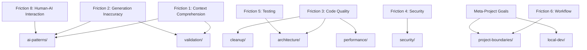

# Hook Taxonomy Visualization

## Friction-to-Folder Mapping



## Hook Distribution

### ai-patterns/ (3 hooks)

Primary Focus: Proactive AI behavior guidance

- 🤖 prevent-improved-files.js
- 🤖 context-validator.js
- 🤖 streaming-pattern-enforcer.js

### cleanup/ (3 hooks)

Primary Focus: Reactive fixes for common mistakes

- 🧹 fix-console-logs.js
- 🧹 import-janitor.js
- 🧹 docs-enforcer.js

### validation/ (3 hooks)

Primary Focus: Input/output validation

- 🔍 validate-prisma.js
- 🔍 api-validator.js
- 🔍 template-integrity-validator.js

### project-boundaries/ (3 hooks)

Primary Focus: Protecting project structure

- 🛡️ block-root-mess.js
- 🛡️ enterprise-antibody.js
- 🛡️ meta-project-guardian.js

### architecture/ (3 hooks)

Primary Focus: Architectural patterns

- 🏗️ architecture-validator.js
- 🏗️ test-location-enforcer.js
- 🏗️ streaming-pattern-enforcer.js

### local-dev/ (2 hooks)

Primary Focus: Local-only enforcement

- 🏠 localhost-enforcer.js
- 🏠 mock-data-enforcer.js

### performance/ (2 hooks)

Primary Focus: Performance optimization

- ⚡ performance-guardian.js
- ⚡ vector-db-hygiene.js

### security/ (2 hooks)

Primary Focus: Security enforcement

- 🔒 security-scan.js
- 🔒 scope-limiter.js

## Hook Event Distribution

### PreToolUse Hooks (14)

```
ai-patterns/      [3] all hooks
project-boundaries/ [3] all hooks
local-dev/        [2] all hooks
architecture/     [2] all hooks
performance/      [2] all hooks
security/         [2] all hooks
```

### PostToolUse Hooks (6)

```
cleanup/          [3] all hooks (fix-console-logs, import-janitor, docs-enforcer)
validation/       [3] all hooks (validate-prisma, api-validator, template-integrity-validator)
```

## Benefits of New Structure

1. **Clear Purpose**: Each folder name immediately conveys its purpose
2. **Balanced Load**: 2-4 hooks per folder prevents overcrowding
3. **Friction Aligned**: Direct mapping to FRICTION-MAPPING.md
4. **Proactive vs Reactive**: Clear separation between prevention (ai-patterns) and correction (cleanup)
5. **Extensible**: Room for growth in each category
6. **Discoverable**: Developers can find hooks by intent
7. **Event-based Organization**: PreToolUse hooks prevent issues, PostToolUse hooks fix them
