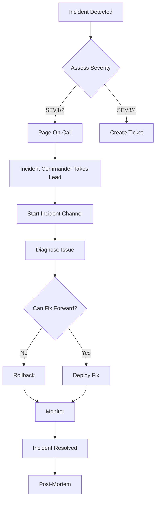

# Incident Response Runbook

This runbook defines how to respond to production incidents effectively and consistently.

## Table of Contents

1. [Incident Severity Levels](#incident-severity-levels)
  2. [SEV1 - Critical](#sev1---critical)
  3. [SEV2 - High](#sev2---high)
  4. [SEV3 - Medium](#sev3---medium)
  5. [SEV4 - Low](#sev4---low)
6. [Incident Response Flow](#incident-response-flow)
7. [Initial Response](#initial-response)
  8. [1. Acknowledge Incident](#1-acknowledge-incident)
  9. [2. Assess Impact](#2-assess-impact)
  10. [3. Establish Command](#3-establish-command)
11. [Communication](#communication)
  12. [Create Incident Channel](#create-incident-channel)
  13. [Status Updates](#status-updates)
  14. [Stakeholder Notifications](#stakeholder-notifications)
    15. [Internal](#internal)
    16. [External (if needed)](#external-if-needed)
17. [Diagnosis Tools](#diagnosis-tools)
  18. [Application Logs](#application-logs)
  19. [System Metrics](#system-metrics)
  20. [Database Queries](#database-queries)
21. [Common Incident Patterns](#common-incident-patterns)
  22. [Pattern 1: Database Connection Pool Exhausted](#pattern-1-database-connection-pool-exhausted)
  23. [Pattern 2: Memory Leak](#pattern-2-memory-leak)
  24. [Pattern 3: Third-Party Service Down](#pattern-3-third-party-service-down)
25. [Incident Commander Checklist](#incident-commander-checklist)
  26. [During Incident](#during-incident)
  27. [Resolution](#resolution)
28. [Recovery Procedures](#recovery-procedures)
  29. [After Rollback](#after-rollback)
  30. [After Fix Forward](#after-fix-forward)
31. [Post-Incident](#post-incident)
  32. [Immediate (Within 2 hours)](#immediate-within-2-hours)
  33. [Within 48 hours](#within-48-hours)
34. [Incident Metrics](#incident-metrics)
35. [Tools and Templates](#tools-and-templates)
  36. [Incident Template](#incident-template)
  37. [Quick Commands](#quick-commands)
38. [Emergency Contacts](#emergency-contacts)
  39. [Internal Escalation](#internal-escalation)
  40. [External Support](#external-support)
41. [Remember](#remember)

## Incident Severity Levels

### SEV1 - Critical

- Complete service outage
- Data loss or corruption
- Security breach
- Payment system failure
- **Response time**: < 5 minutes
- **Escalation**: Immediate

### SEV2 - High

- Partial service outage
- Major feature unavailable
- Performance degradation > 50%
- **Response time**: < 15 minutes
- **Escalation**: Within 30 minutes

### SEV3 - Medium

- Minor feature unavailable
- Performance degradation < 50%
- Non-critical errors affecting < 10% users
- **Response time**: < 1 hour
- **Escalation**: Within 2 hours

### SEV4 - Low

- Cosmetic issues
- Non-blocking errors
- Documentation issues
- **Response time**: Next business day
- **Escalation**: As needed

## Incident Response Flow



## Initial Response

### 1. Acknowledge Incident

```bash
# Mark yourself as responding
./scripts/incident/acknowledge.sh --severity=SEV1

# This will:
# - Update status page
# - Notify team
# - Start incident timer
```

### 2. Assess Impact

Quick checks:

```bash
# System health
curl https://api.example.com/health

# Error rates
npm run monitor:errors -- --last=10m

# Active users affected
npm run monitor:users:affected

# Revenue impact
npm run monitor:revenue:impact
```

### 3. Establish Command

For SEV1/SEV2, assign roles:

- **Incident Commander (IC)**: Leads response
- **Technical Lead**: Investigates and fixes
- **Communications Lead**: Updates stakeholders
- **Scribe**: Documents timeline and actions

## Communication

### Create Incident Channel

```slack
/incident SEV1 Payment processing down

This creates:
#incident-2024-01-15-payments
```

### Status Updates

Every 15 minutes (SEV1) or 30 minutes (SEV2):

```text
UPDATE [14:30 EST]
Status: Investigating root cause
Impact: Payment processing down for 15 min
Actions: Database team checking connections
Next update: 14:45 EST
```

### Stakeholder Notifications

#### Internal

```text
Subject: [SEV1] Production Incident - Payment System

Team,

We are experiencing a SEV1 incident affecting payment processing.

Impact: All payment attempts failing
Start time: 14:15 EST
Incident channel: #incident-2024-01-15-payments
Status page: status.example.com

IC: Jane Smith
Tech Lead: John Doe

Updates every 15 minutes in incident channel.
```

#### External (if needed)

```text
Subject: Service Disruption Notice

We are currently experiencing issues with payment processing.
Our team is actively working on a resolution.

Affected services: Payment processing
Start time: 2:15 PM EST
Estimated resolution: Updates every 30 minutes

Status: status.example.com
```

## Diagnosis Tools

### Application Logs

```bash
# Recent errors
npm run logs:errors -- --last=1h

# Specific service logs
npm run logs:service -- --service=payment-processor

# Search for patterns
npm run logs:search -- --pattern="timeout|connection refused"
```

### System Metrics

```bash
# CPU and memory
npm run metrics:system

# Database connections
npm run metrics:database

# API response times
npm run metrics:api:latency
```

### Database Queries

```sql
-- Check long-running queries
SELECT pid, now() - pg_stat_activity.query_start AS duration, query
FROM pg_stat_activity
WHERE (now() - pg_stat_activity.query_start) > interval '5 minutes';

-- Check connection count
SELECT count(*) FROM pg_stat_activity;

-- Check lock waits
SELECT * FROM pg_locks WHERE NOT granted;
```

## Common Incident Patterns

### Pattern 1: Database Connection Pool Exhausted

**Symptoms**: Timeouts, "no connection available"

**Quick Fix**:

```bash
# Increase pool size temporarily
npm run db:pool:resize -- --size=50

# Kill idle connections
npm run db:connections:kill-idle
```

**Long-term Fix**: Review connection usage, add pooling

### Pattern 2: Memory Leak

**Symptoms**: Gradual performance degradation, OOM errors

**Quick Fix**:

```bash
# Rolling restart
npm run restart:rolling

# Or increase memory temporarily
npm run scale:memory -- --add=2GB
```

**Long-term Fix**: Profile memory usage, fix leaks

### Pattern 3: Third-Party Service Down

**Symptoms**: Specific features failing, external API timeouts

**Quick Fix**:

```bash
# Enable circuit breaker
npm run feature:disable -- --feature=stripe-payments

# Or switch to fallback
npm run config:set -- --key=payment_provider --value=fallback
```

**Long-term Fix**: Implement better fallbacks, add redundancy

## Incident Commander Checklist

### During Incident

- [ ] Take command, announce in channel
- [ ] Assign roles (Tech Lead, Comms, Scribe)
- [ ] Set update cadence
- [ ] Keep focus on resolution, not blame
- [ ] Make decisive calls on rollback vs fix
- [ ] Ensure customer communication
- [ ] Track timeline of events

### Resolution

- [ ] Verify issue resolved
- [ ] Monitor for 30 minutes
- [ ] Stand down incident team
- [ ] Update status page
- [ ] Send all-clear message
- [ ] Schedule post-mortem

## Recovery Procedures

### After Rollback

```bash
# Verify system stable
npm run health:check:full

# Clear any bad cache
npm run cache:clear:all

# Reset circuit breakers
npm run circuits:reset

# Verify data integrity
npm run db:verify:integrity
```

### After Fix Forward

```bash
# Monitor closely for 1 hour
npm run monitor:enhanced -- --duration=1h

# Be ready to rollback
npm run deploy:prepare-rollback

# Keep team on standby
echo "Fix deployed, monitoring for 1 hour" | ./scripts/notify-team.sh
```

## Post-Incident

### Immediate (Within 2 hours)

1. Export incident data

```bash
npm run incident:export -- --id=INC-2024-001
```

2. Create post-mortem document

```bash
npm run incident:create-postmortem -- --id=INC-2024-001
```

3. Preserve evidence

```bash
# Logs
npm run logs:archive -- --incident=INC-2024-001

# Metrics
npm run metrics:snapshot -- --incident=INC-2024-001

# Database state
npm run db:snapshot -- --incident=INC-2024-001
```

### Within 48 hours

1. Conduct blameless post-mortem
2. Create action items
3. Update runbooks
4. Share learnings with team

## Incident Metrics

Track for each incident:

- Time to detection
- Time to acknowledgment
- Time to resolution
- Customer impact (users affected)
- Revenue impact
- Number of people involved

## Tools and Templates

### Incident Template

```yaml
incident:
  id: INC-2024-001
  severity: SEV1
  title: Payment processing outage
  started_at: 2024-01-15T14:15:00Z
  detected_by: monitoring_alert
  resolved_at: 2024-01-15T15:45:00Z

  impact:
    users_affected: 15000
    revenue_lost: $45000
    duration_minutes: 90

  timeline:
    - time: 14:15
      event: Alert triggered
    - time: 14:18
      event: IC assigned
    - time: 14:25
      event: Root cause identified

  action_items:
    - Add monitoring for connection pool
    - Implement auto-scaling
    - Update runbook
```

### Quick Commands

```bash
# Start incident
./scripts/incident/start.sh --severity=SEV1 --title="Database down"

# Update status
./scripts/incident/update.sh --id=INC-001 --status="Investigating"

# Resolve incident
./scripts/incident/resolve.sh --id=INC-001 --resolution="Restarted database"

# Generate report
./scripts/incident/report.sh --id=INC-001
```

## Emergency Contacts

### Internal Escalation

1. On-call Engineer (PagerDuty)
2. Team Lead: [Name] - [Phone]
3. Engineering Manager: [Name] - [Phone]
4. VP Engineering: [Name] - [Phone]
5. CTO: [Name] - [Phone]

### External Support

- AWS Support: [Case URL]
- Database Vendor: [Phone]
- CDN Support: [Phone]
- Security Team: security@example.com

## Remember

- **Stay calm**: Panic makes things worse
- **Over-communicate**: Silence breeds anxiety
- **Focus on recovery**: Blame comes later (never)
- **Document everything**: You'll forget details
- **Learn from incidents**: They're valuable teachers

The goal is recovery, not perfection!
